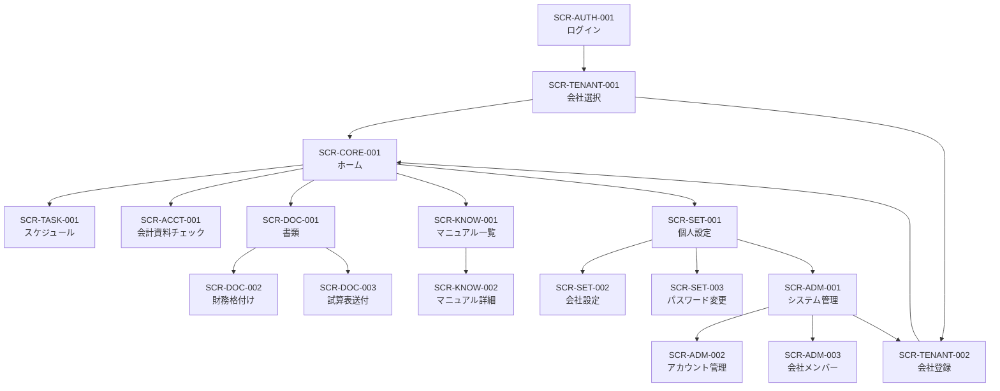

# CLAS FinOps 機能画面一覧

## 0. 文書情報

| 項目 | 内容 |
|---|---|
| 対象リポジトリ | `ANOSkdy/finops_clas` |
| 対象ブランチ | `main` |
| 基準コミット | `8d4300d844e30a0b37ec98843e9259ef24e758e7` |
| 参照資料 | `finops_clas_system_spec_main_8d4300d.md`、`DESIGN.md` |
| 文書用途 | AIエージェントによる画面改修、影響調査、テスト設計、PRレビューの共通台帳 |
| 初版 | 2026-07-17 |
| ステータス | Implementation baseline |

> 本書は、現行コードで確認できる **AS-IS** と、`DESIGN.md` で定めたLinear-inspired UIの **TO-BE** を同じ画面IDで追跡するための資料である。実装開始時には必ず最新`main`を確認し、基準コミット以降のRoute、API、Schema、権限変更を反映すること。

---

## 1. この一覧の使い方

### 1.1 参照順序

変更対象を決めるときは、次の順序で確認する。

1. 本書で対象画面IDと関連APIを特定する。
2. システム仕様書で業務ロジック、データ、認可、不変条件を確認する。
3. `DESIGN.md`でレイアウト、コンポーネント、状態、アクセシビリティを確認する。
4. 対象Page、Route Handler、Validator、Prisma Schema、共通Componentを読む。
5. `PR_DESIGN.md`で対象PR、依存PR、リリースゲートを確認する。

### 1.2 画面変更時の更新対象

次のいずれかを変更したPRでは、本書を同時更新する。

- Route、画面名、Navigation group
- 主要ActionまたはUser flow
- API endpoint、request、response、error code
- Access condition、Role、Membership policy
- 画面State、Empty/Error/Permission表示
- Data entityまたはExternal service依存
- Keyboard shortcut、Responsive pattern
- Business invariantまたはAcceptance criteria

### 1.3 状態表記

| 表記 | 意味 |
|---|---|
| `AS-IS` | 基準コミットの現行実装 |
| `TO-BE` | `DESIGN.md`に基づく目標状態 |
| `Gate` | 全面公開前に解消が必要な安全条件 |
| `Invariant` | UI変更で壊してはならない業務・データ条件 |

---

## 2. 画面ID体系

| Prefix | 領域 |
|---|---|
| `SCR-SYS` | Technical entry、Redirect、App shell |
| `SCR-AUTH` | 認証 |
| `SCR-TENANT` | 会社登録・会社選択 |
| `SCR-CORE` | Home、全体Overview |
| `SCR-TASK` | 税務・労務タスク |
| `SCR-ACCT` | 会計資料チェック |
| `SCR-DOC` | Upload、格付け、試算表送付 |
| `SCR-KNOW` | Manual、Knowledge |
| `SCR-SET` | 個人・会社設定 |
| `SCR-ADM` | Global administration |
| `SURF` | 複数画面へ跨る共通Surface |

画面IDはRouteが変わっても原則維持する。画面を統合・分割する場合は、旧IDから新IDへのMigration mappingを本書へ残す。

---

## 3. 全体機能マップ

### 3.1 中核業務フロー

| Flow ID | フロー | 主要画面 | 完了条件 |
|---|---|---|---|
| `FLOW-01` | Login → Company select → Home | AUTH-001、TENANT-001、CORE-001 | 有効SessionとActive Companyが確立される |
| `FLOW-02` | Company/Tax settings → Schedule refresh | SET-002、TASK-001 | 36か月分の生成タスクが重複なく同期される |
| `FLOW-03` | Task review → Complete/Reopen | CORE-001、TASK-001 | 対象会社のTaskだけが`pending/done`更新される |
| `FLOW-04` | Accounting material check | ACCT-001 | 年度・月・項目単位のCheckがUpsertされる |
| `FLOW-05` | Financial file → Rating | DOC-001、DOC-002 | UploadとRating結果が同一会社・用途で保存される |
| `FLOW-06` | Trial balance → Confirm → Mail | DOC-001、DOC-003 | 送信成否とEmail監査行が保存される |
| `FLOW-07` | Global user/membership administration | ADM-001〜003 | Global権限の範囲でUser/Membershipが安全に変更される |

---

## 4. 共通Surface一覧

| Surface ID | 名称 | 対象 | AS-IS | TO-BE / 必須条件 |
|---|---|---|---|---|
| `SURF-001` | App shell | Login以外の業務画面 | Sticky header + Drawer | Desktop sidebar、Mobile bottom nav、Top bar、Skip link |
| `SURF-002` | Active Company context | 会社Scoped画面 | Headerへ会社名表示、会社切替Button | Sidebar上部で常時表示。切替中は全Mutationを抑止 |
| `SURF-003` | Navigation | 業務画面 | 左Drawer | Grouped sidebar、Active state、Keyboard navigation |
| `SURF-004` | Command palette | 全業務画面 | 未実装 | `Cmd/Ctrl+K`。Navigation、会社切替、Search、Theme |
| `SURF-005` | Theme | 全画面 | Lightのみ | Dark-native + Light。User preferenceを保存 |
| `SURF-006` | Toast / Status feedback | Client画面 | 共通Toastあり | Success/Error/Info、`aria-live`、永続Errorとの使い分け |
| `SURF-007` | Dialog / Confirm | 高リスク操作 | Radix Dialog | 対象・影響・不可逆性を明示。Focus return必須 |
| `SURF-008` | Page state | Data画面 | Pageごとに個別実装 | `loading/ready/empty/needsLogin/needsCompany/forbidden/error`を共通化 |
| `SURF-009` | API error presenter | API利用画面 | UIごとにStatus分岐 | `error.code/message/details`を共通parseしField/Pageへ表示 |
| `SURF-010` | Date/Money formatter | Schedule、Settings等 | UTC/Client計算が混在 | `Asia/Tokyo`を正とし、Date-onlyとDateTimeを分離 |
| `SURF-011` | Permission gate | Settings/Admin | PageごとにRole判定 | UI表示制御とServer再認可を分離。Read-only summaryを提供 |
| `SURF-012` | Loading/Mutation lock | 全Mutation | `busy` state中心 | `saving/sending/uploading/refreshing`等の具体State、二重送信防止 |

### 4.1 Global keyboard target

| Shortcut | Action |
|---|---|
| `Cmd/Ctrl+K` | Command palette |
| `Cmd/Ctrl+Shift+K` | Company switcher |
| `/` | 現在画面のSearchへFocus |
| `g` → `h` | Home |
| `g` → `s` | Schedule |
| `g` → `a` | Accounting |
| `g` → `d` | Documents |
| `g` → `m` | Manual |
| `j` / `k` | List row移動 |
| `Enter` | 選択または明示Action |
| `Esc` | Menu、Dialog、Selectionを閉じる |
| `Shift+?` | Shortcut help |

高リスク操作はShortcutだけで確定しない。

---

## 5. マスター画面一覧

| Screen ID | Route | UI表示名 | Group | 主利用者 | 主なAPI / Data source | Status |
|---|---|---|---|---|---|---|
| `SCR-SYS-001` | `/` | Technical entry | System | 全員 | Middleware | AS-ISは`/login`へRedirect |
| `SCR-AUTH-001` | `/login` | ログイン | Auth | 全員 | `POST /api/auth/login` | Existing / redesign |
| `SCR-TENANT-001` | `/selectcompany` | 会社を選択 | Tenant | 全Login user | auth/me、customer/list、customer/select | Existing / redesign |
| `SCR-TENANT-002` | `/newcompany` | 会社登録 | Tenant/Admin | Login user | `POST /api/customer/new` | Existing / policy review |
| `SCR-CORE-001` | `/home` | ホーム | Overview | Company member | `GET /api/home/summary` | Existing / redesign |
| `SCR-TASK-001` | `/schedule` | スケジュール | Work | Company member | schedule/list、schedule/refresh、tasks/status | Existing / redesign |
| `SCR-ACCT-001` | `/accounting_checklist` | 会計資料チェック | Work | Company member | accounting-checklist系 | Existing / redesign |
| `SCR-DOC-001` | `/upload` | 書類 | Documents | Company member | Navigation only | Existing / rename/redesign |
| `SCR-DOC-002` | `/rating` | 財務格付け | Documents | Company member | customer、uploads、rating/finalize | Existing / security gate |
| `SCR-DOC-003` | `/trial_balance` | 試算表送付 | Documents | Company member | customer、uploads、mail/send | Existing / security gate |
| `SCR-KNOW-001` | `/manual` | マニュアル | Knowledge | Login user | Server DB read | Existing / auth gate |
| `SCR-KNOW-002` | `/manual/[slug]` | マニュアル詳細 | Knowledge | Login user | Server DB read | Existing / renderer redesign |
| `SCR-SET-001` | `/settings` | 個人設定 | Settings | Login user | auth/me、auth/logout | Existing / redesign |
| `SCR-SET-002` | `/company_edit` | 会社設定 | Settings | Company admin等 | customer、tax-settings、recurring due dates | Existing / split layout |
| `SCR-SET-003` | `/password` | パスワード変更 | Settings | Login user | auth/me、account/password | Existing / redesign |
| `SCR-ADM-001` | `/system_manager` | システム管理 | Admin | Global | auth/me | Existing / redesign |
| `SCR-ADM-002` | `/account` | アカウント管理 | Admin | Global | account系 | Existing / destructive gate |
| `SCR-ADM-003` | `/company_member` | 会社メンバー | Admin | Global | company_member | Existing / destructive gate |

---

## 6. 詳細画面仕様

## 6.1 System / Authentication / Tenant

### `SCR-SYS-001` Technical entry

| 項目 | 内容 |
|---|---|
| Route | `/` |
| Current component | `src/app/page.tsx` |
| AS-IS | Middlewareが常に`/login`へRedirectするため、Page本体は実質到達不能 |
| TO-BE | `/`の責務を明文化し、認証状態に応じて`/login`または`/selectcompany`/`/home`へServer-side Redirect |

**Invariant**

- External URLへRedirectしない。
- SessionのCookie存在だけでなく、有効なDB Sessionを正とする。

**Acceptance**

- 未認証は`/login`へ移動する。
- 認証済みでActive Companyなしは`/selectcompany`へ移動する。
- 認証済みでActive Companyありは`/home`へ移動する。

### `SCR-AUTH-001` ログイン

| 項目 | 内容 |
|---|---|
| Route | `/login` |
| Access | Public |
| Goal | Login IDとPasswordでSessionを確立し、安全な内部Routeへ遷移する |
| API | `POST /api/auth/login` |
| Entity | `User`、`Session` |

**主要機能**

- Login ID入力
- Password入力
- EnterによるSubmit
- `next`指定先への遷移
- Authentication error表示

**Required states**

- `idle`、`submitting`、`invalidCredentials`、`networkError`
- 入力不足時はSubmit無効
- エラー後もLogin IDを保持し、PasswordへFocus

**Gate / Invariant**

- `next`は同一originの相対Pathだけを許可する。
- 成功は204とSession Cookie設定を維持する。
- Error文言でLogin IDの存在有無を推測させない。

**TO-BE**

- Dark-nativeの単一Column form。
- Marketing装飾より認証操作を優先する。
- Password managerと`autocomplete`を維持する。

**Acceptance**

- 正常Login、誤Password、空入力、Network errorをKeyboardだけで処理できる。
- 外部URL、protocol-relative URL、`javascript:`を`next`へ指定しても遷移しない。

### `SCR-TENANT-001` 会社を選択

| 項目 | 内容 |
|---|---|
| Route | `/selectcompany` |
| Access | Valid Session |
| Goal | 所属会社からActive Companyを選択する |
| API | `GET /api/auth/me`、`GET /api/customer/list`、`POST /api/customer/select` |
| Entity | `Membership`、`Company`、`Session.activeCompanyId` |

**主要機能**

- 所属会社一覧取得
- 会社名、法人種別、代表者、連絡先表示
- Active Company切替
- 一覧再取得
- 所属会社なし時の会社登録導線

**Required states**

- `loading`、`ready`、`empty`、`needsLogin`、`switching(companyId)`、`error`

**Invariant**

- Membershipがない会社を選択できない。
- 切替中は二重選択を防止する。
- 切替完了後、全Company-scoped画面が新Contextを使う。

**TO-BE**

- Search可能なCompact list。
- Keyboard `j/k`、Enterで選択。
- Company monogramと法人種別を表示し、内部UUIDを通常表示しない。

**Acceptance**

- 0件、1件、多数件、長い会社名を確認する。
- 会社切替後のHome/Schedule/Accountingが対象会社のデータへ切り替わる。

### `SCR-TENANT-002` 会社登録

| 項目 | 内容 |
|---|---|
| Route | `/newcompany` |
| Access | Valid Session（現行） |
| Goal | 新しいCompanyを作成し、作成者をMembershipへ登録してActive化する |
| API | `POST /api/customer/new` |
| Entity | `Company`、`Membership`、`Session` |

**主要機能**

- 法人／個人事業主選択
- 会社名、所在地、決算月、代表者、Email、TEL入力
- 作成後Homeへ遷移

**Invariant**

- 個人事業主は決算月12をServerで強制する。
- 作成者MembershipとActive Company設定は同一業務処理として成功させる。
- 作成者Roleを`owner`にする現行仕様と、編集権限Policyの不整合を解消してから文言を確定する。

**Required states**

- `idle`、`submitting`、`validationError`、`serverError`、`success`

**Acceptance**

- 法人／個人で決算月制約が正しい。
- API失敗時に部分作成が残らない。
- 作成後、対象会社のHomeへ到達できる。

---

## 6.2 Overview / Work

### `SCR-CORE-001` ホーム

| 項目 | 内容 |
|---|---|
| Route | `/home` |
| Access | Active Company Membership |
| Goal | 期限切れ・本日期限・30日以内の要対応事項を即座に把握する |
| API | `GET /api/home/summary` |
| Entity | `Task` |

**主要機能**

- Reminder summary
- 期限Group別Task preview
- Scheduleへの導線
- 再試行、会社選択、Login導線

**Required states**

- `loading`、`ready`、`empty/noUrgentTask`、`needsLogin`、`needsCompany`、`forbidden`、`error`

**Invariant**

- 期限判定はServerの`Asia/Tokyo`基準を表示するだけにする。
- Group件数と表示件数が異なる場合は「一部表示」を明示する。

**TO-BE**

- Dashboard cardの乱立を避け、1つのPriority summaryとCompact listを中心にする。
- 赤や黄は期限Severityに限定する。

**Acceptance**

- 期限なし、期限切れあり、本日期限あり、大量Taskの状態を確認する。
- Company contextが常時視認できる。

### `SCR-TASK-001` スケジュール

| 項目 | 内容 |
|---|---|
| Route | `/schedule` |
| Access | Active Company Membership |
| Goal | 税務・労務期限を月別に確認し、生成同期と完了更新を行う |
| API | `GET /api/schedule/list`、`POST /api/schedule/refresh`、`PATCH /api/tasks/[taskId]/status` |
| Entity | `CompanyTaxSetting`、`CompanyRecurringTaxDueDate`、`Task` |

**主要機能**

- 36か月分のTask生成・同期
- 月別、Category別一覧
- 初期3か月／全期間切替
- Task完了／未完へ戻す
- 期限切れ表示

**Required states**

- `loading`、`ready`、`empty`、`refreshing`、`updatingTask(taskId)`、`needsLogin`、`needsCompany`、`error`

**Business invariants**

- `Task.taskKey`による生成Taskの冪等性を維持する。
- Refreshで完了Taskを削除・未完化しない。
- 標準Taskを任意期限Taskより優先して重複排除する。
- Date、Fiscal period、Holiday ruleはServerを正とする。
- 設定変更後に再生成が必要であることを明示する。

**TO-BE**

- DesktopはLinear風Data list。列はStatus、Title、Category、Due date、Period、Action。
- 月見出しは`YYYY年M月`。
- FilterはCategory、Status、期限範囲。
- MobileはMonth section + compact rows。

**Acceptance**

- Refreshを連続実行して重複しない。
- Done TaskがRefresh後もDoneのまま残る。
- 他社Task ID更新が404/403となる。
- KeyboardでRow移動と完了Actionが可能。

### `SCR-ACCT-001` 会計資料チェック

| 項目 | 内容 |
|---|---|
| Route | `/accounting_checklist` |
| Access | Active Company Membership |
| Goal | 4月〜翌3月の会計資料受領状況を年度・項目単位で管理する |
| API | `GET /api/accounting-checklist`、`POST /api/accounting-checklist/items`、`PATCH /api/accounting-checklist/checks` |
| Entity | `AccountingChecklistItem`、`AccountingChecklistCheck` |

**主要機能**

- Fiscal year切替
- Default 5項目の自動準備
- 月別Checkbox
- 楽観更新とRollback
- 自由項目追加

**Required states**

- `loading`、`ready`、`empty`、`addingItem`、`savingCell(itemId,month)`、`needsLogin`、`needsCompany`、`forbidden`、`error`

**Invariant**

- 一意性`companyId + itemId + fiscalYear + month`を維持する。
- ItemがActive Companyへ所属することをServerで確認する。
- 保存失敗時にUIをServer状態へ戻す。

**TO-BE**

- DesktopはSticky first column付きMatrix。
- Mobileは13列Tableを縮小せず、月単位Listへ変換する。
- Cell保存中・失敗をScreen readerへ通知する。

**Acceptance**

- 4月始まり年度、2000〜2100範囲、保存成功／Rollbackを確認する。
- 同名項目PolicyがAPIとUIで一致する。

---

## 6.3 Documents

### `SCR-DOC-001` 書類

| 項目 | 内容 |
|---|---|
| Route | `/upload` |
| Access | Active Company Membership |
| Goal | 財務格付けと試算表送付の入口を提供する |
| API | なし |

**主要機能**

- 財務格付けへの導線
- 試算表送付への導線
- 各Flowの目的、対応形式、データ取扱いの要約

**Invariant**

- LinkとButtonを入れ子にしない。
- 内部用語`rating`、`trial_balance`を主要UI文言へ露出しない。

**TO-BE**

- 「書類」Hubとして2つのCompact rowまたはPanelを表示する。
- 最近のUpload一覧は、権限・保持方針・Download APIが定義されるまで追加しない。

### `SCR-DOC-002` 財務格付け

| 項目 | 内容 |
|---|---|
| Route | `/rating` |
| Access | Active Company Membership |
| Goal | 財務資料をUploadし、簡易Score、Grade、AI助言を表示する |
| API | `GET /api/customer`、`POST /api/uploads/token`、`POST /api/uploads/complete`、`POST /api/rating/finalize` |
| Entity | `Upload`、`Rating` |
| External | Vercel Blob、Google Gemini |

**主要機能**

- PDF/CSV/XLS/XLSX選択
- 20MB以下のClient SHA-256
- Upload → Metadata登録 → Finalize
- 既存File IDによるFinalize
- Cached Rating再利用
- Score、Grade、AI comment、Highlights表示

**Required states**

- `idle`、`hashing`、`uploading`、`registering`、`finalizing`、`done`、`retryableError`

**Gate / Invariant**

- `purpose=rating`だけを処理する。
- 他社Upload IDを拒否する。
- 認可済みBlobだけをMetadata登録する。
- Public Blobリスク解消前に全面公開しない。
- AIはファイル本文を解析しておらず、メタ情報中心の助言であることを常時明示する。
- Score/Prompt/ModelのVersionを監査可能にする変更はMigrationを伴う。

**TO-BE**

- Stage progressは静かなStep表示。
- UUIDよりFile nameを主要情報として表示。
- ResultはScoreの強調よりDisclaimerと改善Actionを優先する。

**Acceptance**

- 正常Upload、既存ID、Cached result、AI timeout/fallback、Wrong purpose、他社IDを確認する。
- File type、Size、Network errorをFile単位で表示する。

### `SCR-DOC-003` 試算表送付

| 項目 | 内容 |
|---|---|
| Route | `/trial_balance` |
| Access | Active Company Membership |
| Goal | 試算表をUploadし、宛先・件名・本文を確認してMail送信する |
| API | `GET /api/customer`、`POST /api/uploads/token`、`POST /api/uploads/complete`、`POST /api/mail/send` |
| Entity | `Upload`、`Email` |
| External | Vercel Blob、Resend |

**主要機能**

- CSV/XLS/XLSX Upload
- Mail compose
- Attachment確認
- Confirm dialog
- Send resultと監査保存

**Required states**

- `idle`、`uploading`、`uploaded`、`confirming`、`sending`、`sent`、`failed`

**Gate / Invariant**

- `purpose=trial_balance`だけを添付する。
- 他社Uploadを添付できない。
- 宛先・件名・本文・添付をConfirm dialogで表示する。
- Provider disabled/失敗時もEmail監査行を保持する。
- 二重送信、過大添付、任意外部URL添付を防ぐ。

**TO-BE**

- DesktopはUploadとComposeの2段階または2Column。MobileはSequential flow。
- Send shortcutはConfirm dialog内の`Cmd/Ctrl+Enter`に限定可能。
- FailureはToastだけでなく永続Error regionへ表示する。

**Acceptance**

- Send success、Provider disabled、Provider failure、Network failure、Wrong purpose、他社IDを確認する。
- 監査行のStatusが`queued → sent/failed`へ正しく遷移する。

---

## 6.4 Knowledge / Settings

### `SCR-KNOW-001` マニュアル

| 項目 | 内容 |
|---|---|
| Route | `/manual` |
| Access | Valid Session |
| Goal | Manual文書を検索・選択する |
| Data source | Server Componentから`ManualDocument`読取、60秒Cache |

**Gate / Invariant**

- Cookie存在だけでなくServer側で有効Sessionを検証する。
- Cache key/tagに認可漏れを持ち込まない。

**TO-BE**

- Search、Category/更新順、更新日、Keyboard navigation。
- Empty時はAuthoring ownerと登録方法を案内する。

### `SCR-KNOW-002` マニュアル詳細

| 項目 | 内容 |
|---|---|
| Route | `/manual/[slug]` |
| Access | Valid Session |
| Goal | Markdown Manualを安全かつ読みやすく表示する |
| Data source | `getManualDocBySlug` |

**主要機能 / TO-BE**

- Safe Markdown render
- HeadingからTable of contents生成
- Code、Table、Link、List
- 最大幅760px
- Print actionと更新日
- Not found state

**Invariant**

- Raw HTML、危険URL、Scriptを無害化する。
- Manualも有効SessionをServerで検証する。

### `SCR-SET-001` 個人設定

| 項目 | 内容 |
|---|---|
| Route | `/settings` |
| Access | Valid Session |
| Goal | Theme、Account security、Logout、会社設定・Admin導線を提供する |
| API | `GET /api/auth/me`、`POST /api/auth/logout` |

**主要機能**

- Password変更導線
- Logout confirm
- Company settings導線
- GlobalだけAdmin導線
- TO-BEでTheme preference、Shortcut help

**Invariant**

- Admin導線を隠すだけで認可を代替しない。
- Logout後はCookieとDB Sessionを失効する。

### `SCR-SET-002` 会社設定

| 項目 | 内容 |
|---|---|
| Route | `/company_edit` |
| Access | Membership閲覧。編集はSystem admin/globalまたはCompany admin |
| Goal | Company基本情報、税務設定、自治体別納期限を管理する |
| API | `GET/PUT /api/customer`、`GET/PUT /api/company/tax-settings`、recurring-tax-due-dates系 |
| Entity | `Company`、`CompanyTaxSetting`、`CompanyRecurringTaxDueDate` |

**主要機能**

- Basic information
- Tax settings
- Recurring due date create/enable/delete
- Read-only permission表示
- 設定変更後のSchedule refresh導線

**Required states**

- `loading`、`readOnly`、`editing`、`dirty(section)`、`saving(section)`、`saved`、`error`

**Invariant**

- 法人種別は変更不可。
- 個人事業主の決算月は12固定。
- BigInt金額は10進文字列で送受信する。
- 権限はServerで再検証する。
- `owner`と`admin`のPolicy決定前にUIだけで権限を拡大しない。
- 税務設定変更後、Task再生成が必要なことを明示する。

**TO-BE**

- Local sub-navigation: 基本情報 / 税務 / 任意納期限。
- 保存単位をSectionごとに明示し、Sticky save barを使用。
- 権限不足時はDisabled formではなくRead-only summary。

**Acceptance**

- Role別表示とAPI拒否が一致する。
- unsaved warning、Server validation、再生成CTAを確認する。
- `installmentLabel`のClear契約をAPIと一致させる。

### `SCR-SET-003` パスワード変更

| 項目 | 内容 |
|---|---|
| Route | `/password` |
| Access | Valid Session |
| Goal | 現Passwordを確認し、新Passwordへ変更する |
| API | `GET /api/auth/me`、`POST /api/account/password` |
| Entity | `User`、将来`Session` |

**Invariant**

- 新Passwordは8文字以上、現Passwordと異なる。
- Confirm値はClientだけでなく、UI一致をSubmit条件とする。
- Password変更後の他Session失効Policyを明示する。

**TO-BE**

- Password manager対応。
- Strengthを過度に推測せず、明示的要件を表示。
- 将来「全端末からLogout」選択を追加する場合はServer実装と同時に行う。

---

## 6.5 Global Administration

### `SCR-ADM-001` システム管理

| 項目 | 内容 |
|---|---|
| Route | `/system_manager` |
| Access | `User.role=global` |
| Goal | Global管理機能への安全な入口を提供する |
| API | `GET /api/auth/me` |

**主要機能**

- Account management導線
- Company registration導線
- Membership management導線

**Invariant**

- Client redirectだけに依存せず、Server/APIでGlobalを検証する。

### `SCR-ADM-002` アカウント管理

| 項目 | 内容 |
|---|---|
| Route | `/account` |
| Access | `User.role=global` |
| Goal | User作成・一覧・削除を行う |
| API | auth/me、account/list、account/companies、account/create、account/delete |
| Entity | `User`、`Membership`、`Upload`、`Email` |

**主要機能**

- User一覧、Search/Filter
- Login ID、Name、Password、Role、Companyで作成
- Related dataを確認した削除

**Gate / Invariant**

- Login ID unique。
- Password hashはServerのみ。
- 自己削除、最後のGlobal削除、関連Dataあり削除をServerで防止する。
- Delete confirmでUser名、Login ID、影響を表示する。

**TO-BE**

- Compact DataTable、Role badge、Search、Pagination。
- Destructive actionはOverflow menuからConfirmへ。

### `SCR-ADM-003` 会社メンバー

| 項目 | 内容 |
|---|---|
| Route | `/company_member` |
| Access | `User.role=global` |
| Goal | UserとCompanyのMembershipを追加・解除する |
| API | `GET/POST/DELETE /api/company_member` |
| Entity | `Company`、`User`、`Membership` |

**主要機能**

- Company/User/Role選択
- Membership作成
- Duplicate conflict表示
- Membership一覧、Search/Filter
- Membership解除

**Gate / Invariant**

- `(userId, companyId)` unique。
- 最後のOwner/Admin、現在Active Company、自己所属解除等のPolicyをServerで保護する。
- Company内Roleの意味をUIで説明する。

**TO-BE**

- Company別またはUser別のView切替。
- Role変更を将来追加する場合は履歴・監査要件を別途定義する。

---

## 7. 画面別State標準

| State | 表示 | 操作 |
|---|---|---|
| `loading` | Skeleton。Layout shiftを最小化 | Navigationは利用可、対象Actionは無効 |
| `refreshing` | 既存Dataを保持しInline progress | 読取は継続、競合Mutationは抑止 |
| `ready` | 通常Content | 権限に応じたAction |
| `empty` | 理由 + 次のAction | 作成、設定、再読込等を1つ提示 |
| `needsLogin` | Login導線 | `next`は安全な内部Path |
| `needsCompany` | Company switch/register導線 | Company-scoped mutation禁止 |
| `forbidden` | 権限不足理由、戻り先 | Disabled formを大量表示しない |
| `error` | Error summary + Retry | Field errorとPage errorを区別 |
| `saving/sending/uploading` | 対象と進捗を明示 | 二重送信防止、Cancel可否を明示 |
| `success` | Inline confirmationまたはToast | 次ActionへFocusを移動 |

---

## 8. 権限マトリクス

| 画面/Action | `user` | `admin` | `global` | Company `owner` | Company `admin` | `member/accountant` |
|---|---:|---:|---:|---:|---:|---:|
| Company-scoped閲覧 | Membership必要 | Membership必要 | Membership必要 | 可 | 可 | 可 |
| Task refresh/status | Membership必要 | Membership必要 | Membership必要 | 可 | 可 | 可 |
| Checklist更新 | Membership必要 | Membership必要 | Membership必要 | 可 | 可 | 可 |
| Upload/Rating/Mail | Membership必要 | Membership必要 | Membership必要 | 可 | 可 | 可 |
| Company設定編集 | 不可 | 可 | 可 | **現行不可 / Policy要決定** | 可 | 不可 |
| User管理 | 不可 | 不可 | 可 | — | — | — |
| Membership管理 | 不可 | 不可 | 可 | — | — | — |

> `User.role`と`Membership.roleInCompany`は別レイヤーである。UI Agentは片方だけを見て権限判断してはならない。

---

## 9. 画面・API・Entity対応表

| Screen ID | API group | Primary entities | External service |
|---|---|---|---|
| AUTH-001 | auth | User、Session | — |
| TENANT-001/002 | customer | Company、Membership、Session | — |
| CORE-001 | home | Task | — |
| TASK-001 | schedule/tasks/company | CompanyTaxSetting、RecurringDueDate、Task | Holiday source（TO-BE） |
| ACCT-001 | accounting-checklist | ChecklistItem、ChecklistCheck | — |
| DOC-002 | uploads/rating | Upload、Rating | Vercel Blob、Gemini |
| DOC-003 | uploads/mail | Upload、Email | Vercel Blob、Resend |
| KNOW-001/002 | server DB/manual | ManualDocument | — |
| SET-002 | customer/company | Company、TaxSetting、RecurringDueDate | — |
| ADM-002 | account | User、Membership、Upload、Email | — |
| ADM-003 | company_member | User、Company、Membership | — |

---

## 10. UI刷新時の全画面共通Acceptance

### 10.1 Functional

- [ ] Valid SessionとActive Companyの境界が維持される。
- [ ] 他社のTask、File、Checklist item、Company設定へアクセスできない。
- [ ] API request/response/error contract変更が型とTestへ反映される。
- [ ] Date、Fiscal year、OverdueをClient独自計算しない。
- [ ] High-risk actionに対象・影響を示す確認がある。
- [ ] Loading中の多重Mutationが発生しない。

### 10.2 Design / Responsive

- [ ] Dark/Lightで同じ情報階層が成立する。
- [ ] DesktopはSidebar、MobileはBottom nav + Moreを使用する。
- [ ] 320px、200% Zoomで主要Actionが欠落しない。
- [ ] すべてをCardで囲わず、Surface、Spacing、Hairlineで構造化する。
- [ ] Accent `#5e6ad2`はPrimary actionとSelected state中心に使用する。

### 10.3 Accessibility

- [ ] Pageごとに1つの`h1`。
- [ ] Keyboardだけで主要Flowを完了できる。
- [ ] Focus ring、Dialog focus trap、Focus returnが正しい。
- [ ] StatusをColorだけで示さない。
- [ ] Table header、Checkbox、Toast、ProgressがScreen readerで理解できる。
- [ ] Reduced motion、Forced colorsを確認する。

### 10.4 Security gates

- [ ] Manualを含む全App routeで有効SessionをServer検証する。
- [ ] Public financial Blobの扱いが承認済みの安全設計へ移行している。
- [ ] Upload metadataは認可済みBlobだけを受理する。
- [ ] Production Debug APIが無効またはGlobal/Internal限定である。
- [ ] Login redirectが内部Pathに限定される。
- [ ] User/Membership削除のServer invariantがある。

---

## 11. 非画面の運用Endpoint

| Endpoint | 用途 | UI露出 | 注意 |
|---|---|---|---|
| `/api/cron/reminders` | 期限Reminder batch | なし | `CRON_SECRET`、200件上限解消、Paging/再実行/監視が必要 |
| `/api/rating/ping` | Rating health | 通常UIなし | 公開範囲と用途を明文化する |
| `/api/debug/env` | Environment診断 | Production不可 | 情報漏えいGate |
| `/api/debug/db` | DB接続診断 | Production不可 | User件数・Error露出Gate |

---

## 12. Change log

| Date | Version | Change |
|---|---|---|
| 2026-07-17 | 0.1 | `main@8d4300d`、システム仕様書、`DESIGN.md`を基準に初版作成 |
