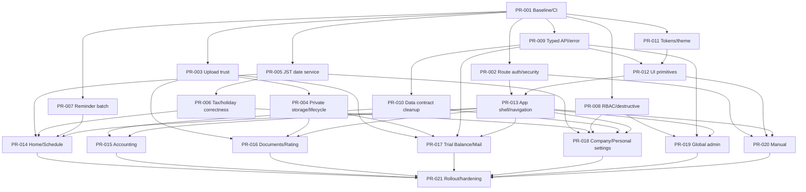

# CLAS FinOps PR設計書

## 0. 文書情報

| 項目 | 内容 |
|---|---|
| Repository | `ANOSkdy/finops_clas` |
| Base branch | `main` |
| Documentation baseline | `8d4300d844e30a0b37ec98843e9259ef24e758e7` |
| 参照資料 | System spec、`DESIGN.md`、`FUNCTION_SCREEN_LIST.md`、`AGENTS.md` |
| 目的 | AIエージェントが安全に、Review可能な単位で、Linear-inspired UI刷新と基盤改善を実装するためのPR分割 |
| 初版 | 2026-07-17 |
| Status | Proposed roadmap |

> 実装開始時は最新`main`のSHAを再確認する。基準SHA以降の変更が本設計へ影響する場合、最初のPRで本書を更新してから着手する。

---

## 1. Delivery objective

本計画は、次を同時に達成する。

1. Auth、Tenant、Storage、Date、Tax、Reminder、Admin操作の既知Riskを先に封じる。
2. API、Error、Design token、Componentを共通化し、画面ごとの重複実装を減らす。
3. 現行業務ロジックを維持したまま、Linear風の静かで精密なDark-native UIへ段階移行する。
4. Route単位のFeature flagとRollback pathを持ち、全面切替前にRole別UATを行う。
5. 各PRをAIエージェントが独立して理解・検証・Reviewできる大きさに保つ。

### 1.1 Non-goals

このPRシリーズでは次を実装しない。

- RFID、IoT、日報、工程管理
- 現場写真、図面、黒板、注釈
- Offline/PWA同期
- Board/Kanban、Drag & Drop
- AIによる自動承認、自動送信
- 会計ソフト、銀行APIとの自動同期
- SAML/OIDC/MFA

これらは別Epicで業務仕様、権限、監査、Data ownershipを定義する。

---

## 2. PR分割原則

- 1 PRは1つの主要目的に限定する。
- Security/Domain/Data migrationと大規模UI変更を同じPRへ入れない。
- Shared foundationを先にMergeし、各画面PRはFoundationを消費するだけにする。
- 税務Rule変更はUI PRと分離し、Domain reviewer承認を必須にする。
- MigrationはAdditive、Backward-compatibleを優先する。
- 各画面PRにLoading、Empty、Error、Permission、Keyboard、Responsiveを含める。
- Testを最終PRへ先送りしない。対象PRごとに関連Testを追加する。
- 全面公開はP0/P1 Release gate解消後に行う。

### 2.1 推奨Branch命名

```text
codex/pr-<NNN>-<short-kebab-slug>
```

例:

```text
codex/pr-013-app-shell-navigation
```

### 2.2 PR本文に必須のTraceability

- 本書のPR ID
- `FUNCTION_SCREEN_LIST.md`のScreen ID
- System specのRisk ID
- 変更Route/API/Entity
- Migration名
- Feature flag名
- Test evidence
- Rollback方法

---

## 3. Release gates

| Gate ID | 条件 | 解消PR |
|---|---|---|
| `G-AUTH` | Manualを含む全App routeで有効SessionをServer検証 | PR-002 |
| `G-REDIRECT` | Login `next`を内部相対Pathへ限定 | PR-002 |
| `G-DEBUG` | Production Debug APIを無効化またはGlobal/Internal限定 | PR-002 |
| `G-UPLOAD-TRUST` | Upload metadataが認可済みObjectだけを受理 | PR-003 |
| `G-STORAGE` | 財務FileのPublic URLリスクを解消、または期限付き承認例外 | PR-004 |
| `G-DATE` | `Asia/Tokyo`の今日・年度・期限をServerで統一 | PR-005 |
| `G-TAX` | 税務期間計算と祝日RuleをGolden test + Domain review | PR-006 |
| `G-CRON` | 200件超のReminder処理漏れを解消 | PR-007 |
| `G-DESTRUCTIVE` | 最後の管理者/Owner、自己削除等をServerで保護 | PR-008 |
| `G-API` | Error contractとTyped clientを統一 | PR-009 |
| `G-TEST` | Critical flow、Visual、a11y、Tenant testsがRelease branchでPass | PR-001および各PR、最終PR-021 |

全面公開は全Gateが`Done`または承認済みRisk acceptanceでなければならない。

---

## 4. Dependency graph



### 4.1 Parallel execution lanes

PR-001 Merge後、次は並行可能である。

- Security lane: PR-002、PR-003、PR-007、PR-008
- Domain lane: PR-005 → PR-006
- Contract lane: PR-009 → PR-010
- Design foundation lane: PR-011。PR-012はPR-009後

同一Fileへ集中するPRは順序を調整する。特に`src/app/(app)/layout.tsx`、`src/app/globals.css`、Auth helper、API clientは競合しやすい。

---

## 5. Roadmap summary

| PR ID | Title | Phase | Depends on | Primary screens | Risks | Status |
|---|---|---|---|---|---|---|
| PR-001 | Characterization tests and CI baseline | 0 | — | 全体 | R-14、R-28 | Not started |
| PR-002 | Server route auth, safe redirect, debug lockdown | 1 | 001 | SYS/AUTH/KNOW | R-02、R-07、R-09、R-23 | Not started |
| PR-003 | Trusted upload completion and DB uniqueness | 1 | 001 | DOC-002/003 | R-08、R-17 | Not started |
| PR-004 | Private file access and lifecycle migration | 1 | 003 | DOC-002/003 | R-01、R-15 | Not started |
| PR-005 | Asia/Tokyo date service and boundary cleanup | 1 | 001 | CORE/TASK/ACCT/SET | R-04、R-26 | Not started |
| PR-006 | Versioned tax and holiday rule correction | 1 | 005 | TASK/SET | R-03、R-05 | Not started |
| PR-007 | Reminder pagination, idempotency, observability | 1 | 001 | Non-screen/Cron | R-10、R-27、R-30 | Not started |
| PR-008 | RBAC policy and destructive server invariants | 1 | 001 | TENANT/SET/ADM | R-06、R-11、R-24 | Not started |
| PR-009 | Typed API client and standard error contract | 2 | 001 | 全Client画面 | R-12 | Not started |
| PR-010 | Checklist/recurring data contract cleanup | 2 | 009 | ACCT/SET | R-18、R-19 | Not started |
| PR-011 | Canonical tokens and Dark/Light theme | 2 | 001 | 全画面 | R-13 | Not started |
| PR-012 | Accessible UI primitives and state patterns | 2 | 009,011 | 全画面 | R-13、R-14 | Not started |
| PR-013 | App shell, sidebar, company switcher, command palette | 2 | 002,012 | SURF、全業務画面 | Navigation/a11y | Not started |
| PR-014 | Home and Schedule migration | 3 | 005,006,007,013 | CORE-001、TASK-001 | R-16、R-26 | Not started |
| PR-015 | Accounting checklist migration | 3 | 010,013 | ACCT-001 | R-18 | Not started |
| PR-016 | Documents hub and Financial Rating migration | 3 | 003,004,013 | DOC-001/002 | R-01、R-21、R-22 | Not started |
| PR-017 | Trial Balance send and Mail UX migration | 3 | 003,004,009,013 | DOC-003 | R-20 | Not started |
| PR-018 | Company onboarding, company settings, password | 3 | 005,006,008,010,013 | TENANT-001/002、SET-001/002/003 | R-06、R-16、R-24 | Not started |
| PR-019 | Global administration migration | 3 | 008,009,013 | ADM-001/002/003 | R-11 | Not started |
| PR-020 | Secure Manual renderer and knowledge UX | 3 | 002,012,013 | KNOW-001/002 | R-02、R-25 | Not started |
| PR-021 | Feature-flag rollout, full regression, runbook | 4 | 014〜020 | 全体 | R-14、R-30 | Not started |

---

## 6. Detailed PR specifications

## Phase 0 — Baseline

### PR-001 — Characterization tests and CI baseline

| 項目 | 内容 |
|---|---|
| Branch | `codex/pr-001-characterization-ci` |
| Type | Test / CI / Documentation |
| Dependencies | なし |
| Screen IDs | 全画面 |
| Risk IDs | R-14、R-28 |
| Behavior change | なし |

**目的**

UIやSecurity修正に先立ち、現行挙動と主要画面のBaselineを自動検証できる状態にする。

**In scope**

- CI workflow: install、lint、typecheck、domain tests、build
- Minimal unit/contract test runnerの導入
- Tenant A/B test fixture
- 現行Tax schedule testの正式なTest suite化
- Auth/Tenant、Task refresh、Checklist、Upload purpose、Mail auditのCharacterization tests
- Playwright相当のE2E/visual基盤と主要Route screenshot baseline
- Test用EnvironmentとData setupの文書化
- `README.md`の起動・Test・Environment説明

**Out of scope**

- 現行Behaviorの修正
- UI redesign
- Production migration

**Hotspots**

- `package.json`
- `.github/workflows/**`
- `scripts/test-tax-schedule.ts`
- `tests/**`、`e2e/**`
- Test DB setup

**Acceptance**

- `pnpm lint`、`pnpm typecheck`、`pnpm test:tax-schedule`がCIでPassする。
- Critical pathのうち少なくともLogin/Company select/Schedule refreshのBaselineがある。
- Company AのCredentialでCompany BのResourceを取得できないTestがある。
- BuildでMigrationを自動実行しない。
- TestがProduction Providerへ接続しない。

**Rollback**

Test/CIのみのためApplication rollback不要。Flaky testは削除せず、原因を記録してQuarantine期限を設定する。

---

## Phase 1 — Production safety

### PR-002 — Server route auth, safe redirect, debug lockdown

| 項目 | 内容 |
|---|---|
| Branch | `codex/pr-002-server-auth-guards` |
| Dependencies | PR-001 |
| Screen IDs | SCR-SYS-001、SCR-AUTH-001、SCR-KNOW-001/002、全Protected screen |
| Risk IDs | R-02、R-07、R-09、R-23 |
| Review | Security + Backend |

**目的**

Cookie存在だけに依存しないServer-side route protectionへ統一し、Open redirectとProduction debug exposureを閉じる。

**In scope**

- `(app)`配下または共通Server layoutで有効Sessionを検証
- Manual list/detailにも同一Session guardを適用
- Middleware保護Path漏れを解消、またはMiddlewareを補助的役割へ限定
- Login `next`を同一origin相対PathのAllowlistへ制限
- `/api/debug/env`、`/api/debug/db`をProduction無効化またはGlobal/Internal限定
- Unauthorized/Forbidden/Active Companyなしの共通Redirect/State
- `/`の認証状態別Redirect整理

**Out of scope**

- Role policy変更
- UI shell刷新
- OAuth/MFA

**Tests**

- 偽Cookie、期限切れSession、削除済みSession
- Manualへの未認証アクセス
- `/trial_balance`、`/accounting_checklist`、`/company_member`のPage access
- External/protocol-relative/encoded redirect拒否
- Production modeのDebug endpoint拒否

**Rollout / Rollback**

- Previewで全RoleのRoute matrixを検証する。
- Redirect loopを検知するMonitoringを追加する。
- Rollback時もDebug endpointはPublicへ戻さない。

---

### PR-003 — Trusted upload completion and DB uniqueness

| 項目 | 内容 |
|---|---|
| Branch | `codex/pr-003-trusted-upload-completion` |
| Dependencies | PR-001 |
| Screen IDs | SCR-DOC-002、SCR-DOC-003 |
| Risk IDs | R-08、R-17 |
| Review | Security + Backend + Data |

**目的**

`/api/uploads/complete`が任意URLをUploadとして登録できる状態を解消し、同一Objectの重複登録をDBで防ぐ。

**In scope**

- Server-issued upload identityまたはtrusted callback metadataの導入
- Completion時にStorage host、pathname、companyId、purpose、MIME、Sizeを再検証
- Clientから送られたURLだけを信頼しない
- Unique constraint: `(companyId, storageProvider, storageKey)`
- Concurrent completionのUpsert化
- Purpose/Company mismatchの標準Error
- Legacy record監査用ScriptまたはQuery

**Migration**

- Duplicate recordを事前検出する。
- Unique追加前に重複解消方針を決定する。
- Rating/Email参照があるUploadを安易に削除しない。

**Tests**

- Allowed object
- Wrong host/path/company/purpose/MIME/size
- Replayed completion
- Concurrent completion
- Other-company object

**Out of scope**

- Public→Private access変更。PR-004で実施。

**Rollback**

DB uniqueをRollbackするより、Application dual-read/upsertを維持する。Constraint rollbackが必要な場合もDataを削除しない。

---

### PR-004 — Private file access and lifecycle migration

| 項目 | 内容 |
|---|---|
| Branch | `codex/pr-004-private-file-lifecycle` |
| Dependencies | PR-003 |
| Screen IDs | SCR-DOC-002、SCR-DOC-003 |
| Risk IDs | R-01、R-15 |
| Review | Security + Data governance + Infrastructure |

**目的**

財務資料を直接Public URLで扱わず、認証・Tenant検証されたAccess path、Retention、Deletion auditを導入する。

**Decision checkpoint**

ProviderのPrivate object機能、署名URL、Authenticated proxyのいずれを採用するかをADRで決定する。Provider仕様を確認せず実装方式を決め打ちしない。

**In scope**

- Authenticated download/preview abstraction
- Temporary access URLまたはServer stream
- UI/APIからRaw storage URLを除去
- Existing public objectsのInventoryとMigration state
- Dual-read期間
- Retention/Deletion policy、Delete API、Audit
- Email attachment取得方式の更新
- Feature flag `PRIVATE_UPLOADS_V1`

**Data migration states例**

- `legacy_public`
- `migrating`
- `private_ready`
- `failed`

実際のSchemaはADRで決定する。

**Tests**

- Valid member download
- Other-company denial
- Expired access URL
- Deleted object
- Legacy dual-read
- Mail attachment download

**Rollout**

1. New uploadsをPrivate pathへ。
2. Existing objectをBatch migration。
3. Dual-readで監視。
4. Public path参照ゼロを確認。
5. Legacy public accessを無効化。

**Rollback**

Feature flagで旧Read pathへ一時戻せるが、新規Public uploadへ戻さない。Migration metadataを失わない。

---

### PR-005 — Asia/Tokyo date service and boundary cleanup

| 項目 | 内容 |
|---|---|
| Branch | `codex/pr-005-jst-date-service` |
| Dependencies | PR-001 |
| Screen IDs | SCR-CORE-001、SCR-TASK-001、SCR-ACCT-001、SCR-SET-002 |
| Risk IDs | R-04、R-26 |
| Review | Backend + Domain + Frontend |

**目的**

「今日」「年度」「期限切れ」「月見出し」を`Asia/Tokyo`で一貫させ、Client/UTC独自計算を除去する。

**In scope**

- Shared business date service
- Date-only type/formatter
- Server-calculated fiscal year、overdue、date range
- Home/Schedule/Accounting/CronでJST boundaryを統一
- Clientの3か月FilterをServer queryまたは共有契約へ移行
- Schedule月見出し`YYYY年M月`

**Out of scope**

- Tax formula/periodの修正。PR-006。
- Holiday source導入。PR-006。

**Tests**

- JST 00:00直前/直後
- UTC前日との境界
- Month/year boundary
- Leap day
- Fiscal year 3/31→4/1
- Date-only round trip

**Rollout**

Date behavior diffをPreviewで比較し、既存Task row自体は変更せず表示・判定から切り替える。

---

### PR-006 — Versioned tax and holiday rule correction

| 項目 | 内容 |
|---|---|
| Branch | `codex/pr-006-versioned-tax-rules` |
| Dependencies | PR-005 |
| Screen IDs | SCR-TASK-001、SCR-SET-002 |
| Risk IDs | R-03、R-05 |
| Review | Tax domain reviewer必須 + Backend |

**目的**

個人申告・法人中間期間等の既知不整合を修正し、日本祝日を含むRuleをVersion管理する。

**Merge gate**

Domain reviewerの署名、Rule source、Effective date、Golden testが揃うまでMergeしない。

**In scope**

- Rule ID/Version/Effective date
- Corporate/sole tax period correction
- Japanese holiday calendar source + version
- Business day adjustment
- Golden fixtures
- Existing generated Taskとの差分Dry-run report
- Rebuild/keep/archive policy
- Configurable rule versionまたはFeature flag

**Out of scope**

- 税務助言UI
- 未承認の新Tax category

**Tests**

- 法人決算月別
- 個人事業年次
- 法人税/消費税中間回数境界
- Weekend + Holiday consecutive shift
- Year-end/New-year
- Existing done task preservation

**Rollback**

旧Rule versionへRead/Generateを戻せる。新Ruleで生成したTaskを無差別削除せず、Task key versionとStatusを考慮する。

---

### PR-007 — Reminder pagination, idempotency, observability

| 項目 | 内容 |
|---|---|
| Branch | `codex/pr-007-reminder-batch-observability` |
| Dependencies | PR-001 |
| Screen IDs | Non-screen `/api/cron/reminders`、SCR-CORE-001の表示に間接影響 |
| Risk IDs | R-10、R-27、R-30 |
| Review | Backend + Operations |

**目的**

200件を超えるTaskも漏れなく処理し、重複送信を防ぎ、再実行・監視可能なBatchへする。

**In scope**

- Cursor pagination / batch loop
- Execution time budgetとResume cursor
- Delivery unique keyを利用したIdempotency
- Structured logとRun summary
- Partial failure handling
- Manual retry/runbook
- Overdue reminder policyを設定可能にする前のProduct decision記録

**Tests**

- 0件、1件、201件、1000件
- Duplicate invocation
- Provider failure halfway
- Resume
- Missing contact email
- Existing delivery conflict

**Rollout**

Preview/stagingでDry-run modeを設け、対象件数と送信予定を比較する。初回Productionは送信上限とAlertを設定する。

---

### PR-008 — RBAC policy and destructive server invariants

| 項目 | 内容 |
|---|---|
| Branch | `codex/pr-008-rbac-destructive-invariants` |
| Dependencies | PR-001 |
| Screen IDs | SCR-TENANT-002、SCR-SET-002/003、SCR-ADM-002/003 |
| Risk IDs | R-06、R-11、R-24 |
| Review | Product + Security + Backend |

**Decision checkpoint**

- Company creatorの`owner`を編集可能にするか。
- 最後のOwner/Company adminをどのRoleで判定するか。
- Password変更後にCurrent session以外を失効するか。

決定前は現行権限を保持し、UIだけで変更しない。

**In scope**

- Shared authorization policy
- Self-delete防止
- Last global防止
- Last owner/admin protection
- Membership removal時のActive Company整合性
- Related data conflictの標準Error
- Password change時のSession policy実装
- Confirm用影響Preview APIが必要なら追加

**Tests**

- Role matrix
- Self/other user delete
- Last global
- Last owner/admin
- Active membership removal
- Company creator flow
- Password change session behavior

**Rollback**

PolicyはFeature flagではなくServer invariantを原則とする。誤判定時は緊急Admin overrideを監査付きで用意し、保護自体を全面解除しない。

---

## Phase 2 — Contract and design foundation

### PR-009 — Typed API client and standard error contract

| 項目 | 内容 |
|---|---|
| Branch | `codex/pr-009-typed-api-errors` |
| Dependencies | PR-001 |
| Screen IDs | 全Client screen |
| Risk IDs | R-12 |
| Review | Frontend + Backend |

**目的**

Pageごとの`fetch`、Credential、Status分岐、Error parseを共通化し、`error.details`不一致を解消する。

**In scope**

- Shared typed API client
- `ApiError` parser
- 401/403/needsCompany mapping
- Request/response contracts
- Existing UIの`json.details`参照修正
- Mutation double-submit helper
- Cron等の非標準Errorを段階統一

**Migration strategy**

Endpointごとに順次Clientを移行し、旧Responseとの互換Parserを一時保持する。全Client移行後に不要互換を削除する。

**Tests**

- JSON/non-JSON error
- Standard envelope
- Legacy envelope
- Empty 204
- Network/abort
- Field detail mapping

---

### PR-010 — Checklist and recurring data contract cleanup

| 項目 | 内容 |
|---|---|
| Branch | `codex/pr-010-data-contract-cleanup` |
| Dependencies | PR-009 |
| Screen IDs | SCR-ACCT-001、SCR-SET-002 |
| Risk IDs | R-18、R-19 |
| Review | Backend + Data + Frontend |

**目的**

UIとAPIで食い違うChecklist duplicate policy、Recurring label clear契約を整合させる。

**In scope**

- Checklist item name normalize/duplicate policy
- 必要なUnique indexとduplicate backfill
- API 409 contract
- Item edit/delete/reorderを追加するかは別Decision。初期は追加のみでもよい
- `installmentLabel: null`でClear可能なPATCH contract
- Contract testsとClient移行

**Migration**

同名Itemが存在する場合のMerge/rename方針をData reportに基づき決定する。Checksを失わない。

---

### PR-011 — Canonical tokens and Dark/Light theme

| 項目 | 内容 |
|---|---|
| Branch | `codex/pr-011-design-tokens-theme` |
| Dependencies | PR-001 |
| Screen IDs | 全画面、SURF-005 |
| Risk IDs | R-13 |
| Review | Design + Frontend + Accessibility |

**目的**

`DESIGN.md`のCanonical tokensを実装し、旧Token参照を互換Alias経由へ統一する。構造や業務Behaviorは変えない。

**In scope**

- `tokens.css`、dark/light theme
- Existing `--color-*` alias
- Theme preference + OS default
- Print theme foundation
- Undefined legacy variablesのInventory
- Style/visual tests

**Out of scope**

- App shell再構築
- Screen layout変更

**Acceptance**

- Dark/Lightで主要Routeが読める。
- Color literalと旧`glass/ink/panel/line/button`への新規依存がない。
- Focus/Semantic colorsがAA基準を満たす。

---

### PR-012 — Accessible UI primitives and state patterns

| 項目 | 内容 |
|---|---|
| Branch | `codex/pr-012-ui-primitives-states` |
| Dependencies | PR-009、PR-011 |
| Screen IDs | 全画面、SURF-006〜012 |
| Review | Design + Frontend + Accessibility |

**目的**

Button、Field、Dialog、Toast、Badge、Skeleton、Page state等を共通化し、画面PRが業務Compositionへ集中できるようにする。

**In scope**

- Button/IconButton
- TextField/Select/Textarea/Checkbox
- Badge/Status semantics
- Dialog/DestructiveConfirm
- Toast + Persistent error
- Skeleton/Progress
- Empty/Error/Permission state
- PageHeader、FormSection、StickySaveBar
- Component state fixtures
- Link/Button nesting解消用pattern

**Acceptance**

- Default/Hover/Pressed/Selected/Focus/Disabled/Busy/Errorを確認。
- Keyboard、Screen reader、Reduced motion、Forced colorsに対応。
- Dark/Light、Long Japanese text、200% ZoomのVisual testがある。

---

### PR-013 — App shell, sidebar, company switcher, command palette

| 項目 | 内容 |
|---|---|
| Branch | `codex/pr-013-app-shell-navigation` |
| Dependencies | PR-002、PR-012 |
| Screen IDs | SURF-001〜005、全業務画面 |
| Review | Design + Frontend + Accessibility + Security |

**目的**

Linear-inspiredのDesktop sidebar、Mobile navigation、Company context、Command paletteを導入する。

**In scope**

- AppShell
- Desktop sidebar 248px / collapsed rail
- Grouped navigation
- Company switcher
- Top bar/Breadcrumb
- Mobile bottom nav + More sheet
- Command palette navigation
- Global shortcuts
- Skip link、Navigation focus management
- Route単位Feature flag foundation

**Invariant**

- Company contextを常時表示する。
- Company切替中はCompany-scoped mutationを抑止する。
- Global admin navigationはRoleで表示制御し、Server再認可を維持する。

**Tests**

- Desktop/Tablet/Mobile
- Sidebar collapse
- Company switch
- `Cmd/Ctrl+K`、`Cmd/Ctrl+Shift+K`、`g` sequences
- Dialog/Drawer focus return
- Unauthorized navigation

**Rollback**

`NEW_APP_SHELL` flagで旧Header/DrawerへRoute単位に戻せる。Auth guardはRollback対象にしない。

---

## Phase 3 — Screen migration

### PR-014 — Home and Schedule migration

| 項目 | 内容 |
|---|---|
| Branch | `codex/pr-014-home-schedule-ui` |
| Dependencies | PR-005、PR-006、PR-007、PR-013 |
| Screen IDs | SCR-CORE-001、SCR-TASK-001 |
| Risk IDs | R-16、R-26 |
| Review | Design + Frontend + Domain + QA |

**In scope**

- Home priority summary + compact task list
- Schedule Linear-style data list
- Filter: category/status/date range
- `YYYY年M月` heading
- Done/Reopen row action
- Refresh impact explanation
- Company/tax setting dirty indicatorまたは再生成CTA
- Mobile month sections
- Keyboard row navigation
- Loading/Empty/Error/Permission states

**Invariant tests**

- Refresh idempotency
- Done preservation
- Standard/recurring dedupe
- JST overdue
- Other-company task rejection

**Feature flag**

`NEW_HOME_SCHEDULE_UI`

---

### PR-015 — Accounting checklist migration

| 項目 | 内容 |
|---|---|
| Branch | `codex/pr-015-accounting-checklist-ui` |
| Dependencies | PR-010、PR-013 |
| Screen IDs | SCR-ACCT-001 |
| Review | Design + Frontend + Accessibility + QA |

**In scope**

- Desktop matrix + sticky first column
- Fiscal year selector
- Cell saving/error state
- Optimistic update/rollback
- Add item flow
- Mobile month-by-month list
- Print style
- Keyboard cell navigationを導入する場合はTable semanticsを維持

**Tests**

- Default item initialization
- Cell update success/failure
- Duplicate name conflict
- Other-company item
- Desktop horizontal scroll
- Mobile conversion
- Screen reader header association

**Feature flag**

`NEW_ACCOUNTING_UI`

---

### PR-016 — Documents hub and Financial Rating migration

| 項目 | 内容 |
|---|---|
| Branch | `codex/pr-016-documents-rating-ui` |
| Dependencies | PR-003、PR-004、PR-013 |
| Screen IDs | SCR-DOC-001、SCR-DOC-002 |
| Risk IDs | R-21、R-22 |
| Review | Design + Security + AI/Product + QA |

**In scope**

- `/upload`を「書類」Hubへ再設計
- FileDropzone/Picker
- Upload stage progress
- File name/type/size表示
- Existing file selectionを安全なUIへ変更
- Rating result、Highlights、Disclaimer
- AI/Score/Model version表示方針
- Retry/error recovery

**Invariant**

- `purpose=rating`
- Other-company denial
- Cached result policy
- Raw public URL非表示
- AIが全文解析ではないことを明示

**Tests**

- Upload success/failure
- Wrong type/size
- Existing ID/record selection
- Cache hit
- Gemini timeout/fallback/malformed result
- Dark/Light/Mobile

**Feature flag**

`NEW_DOCUMENTS_RATING_UI`

---

### PR-017 — Trial Balance send and Mail UX migration

| 項目 | 内容 |
|---|---|
| Branch | `codex/pr-017-trial-balance-mail-ui` |
| Dependencies | PR-003、PR-004、PR-009、PR-013 |
| Screen IDs | SCR-DOC-003 |
| Risk IDs | R-20 |
| Review | Design + Security + Backend + QA |

**In scope**

- Sequential upload → compose → confirm → send flow
- Desktop two-stage layout、Mobile vertical layout
- Recipient/subject/body validation
- Attachment summary byFile name
- Confirm dialog
- Sending/idempotency lock
- Provider disabled/failure/success states
- Audit result表示
- Attachment size limitとRetry policyがBackendで実装済みならUI対応

**Invariant**

- `purpose=trial_balance`
- Other-company attachment拒否
- Failure時もEmail audit保持
- Confirmなしで送信しない

**Feature flag**

`NEW_TRIAL_BALANCE_UI`

---

### PR-018 — Company onboarding, company settings, personal settings

| 項目 | 内容 |
|---|---|
| Branch | `codex/pr-018-company-personal-settings-ui` |
| Dependencies | PR-005、PR-006、PR-008、PR-010、PR-013 |
| Screen IDs | SCR-TENANT-001/002、SCR-SET-001/002/003 |
| Review | Design + Product + Domain + Security + QA |

**In scope**

- Company selection search/keyboard
- Company registration form
- Personal settings、Theme、Logout
- Company settings local navigation
- Basic/Tax/Recurring sections
- Dirty state、Sticky save、Unsaved warning
- Read-only summary
- Schedule refresh CTA
- Password formとSession policy表示

**Invariant**

- Sole closing month=12
- Legal form immutable
- Money string
- Server permission
- Owner policy
- Recurring clear contract

**Feature flag**

`NEW_SETTINGS_UI`

---

### PR-019 — Global administration migration

| 項目 | 内容 |
|---|---|
| Branch | `codex/pr-019-global-admin-ui` |
| Dependencies | PR-008、PR-009、PR-013 |
| Screen IDs | SCR-ADM-001/002/003 |
| Review | Design + Security + Backend + QA |

**In scope**

- System manager landing
- User list search/filter/pagination
- User create form
- User delete impact/confirm
- Membership company/user views
- Duplicate/forbidden/conflict states
- Last global/owner/admin protectionsのUI表現
- Audit metadataがある場合の表示

**Invariant**

- Global only
- Self/last admin protection
- Related data conflict
- Membership unique
- Server authorization

**Feature flag**

`NEW_ADMIN_UI`

---

### PR-020 — Secure Manual renderer and knowledge UX

| 項目 | 内容 |
|---|---|
| Branch | `codex/pr-020-manual-knowledge-ui` |
| Dependencies | PR-002、PR-012、PR-013 |
| Screen IDs | SCR-KNOW-001/002 |
| Risk IDs | R-25 |
| Review | Security + Design + Frontend + Content owner |

**In scope**

- Authenticated Manual list/detail
- Safe Markdown renderer
- Heading TOC
- Code/Table/List/Link styles
- Search
- Updated date
- Print style
- Not found/Empty/Error
- Cache invalidation contractの確認

**Out of scope**

- Full authoring/admin CRUD。必要なら別PR。

**Tests**

- Unauthorized
- XSS/unsafe URL fixture
- Long document
- Table/code
- Cache refresh
- Print

**Feature flag**

`NEW_MANUAL_UI`

---

## Phase 4 — Rollout and hardening

### PR-021 — Feature-flag rollout, full regression, runbook

| 項目 | 内容 |
|---|---|
| Branch | `codex/pr-021-rollout-hardening` |
| Dependencies | PR-014〜020 |
| Screen IDs | 全画面 |
| Risk IDs | R-14、R-30 |
| Review | Product + Engineering + QA + Security + Operations |

**目的**

Route別Feature flag、Role別UAT、Monitoring、Rollback手順を整え、新UIを段階公開する。

**In scope**

- Feature flag inventoryとDefault
- Route/Role/company cohort rollout
- Full E2E/visual/a11y regression
- Performance measurement
- Error/latency/upload/mail/reminder metrics
- Structured logging/trace ID
- UAT checklist
- Rollback runbook
- Old UI removal criteriaと期限
- Documentation baseline SHA更新

**Release sequence**

1. Internal global users
2. Test companies
3. Company admins
4. Accounting users
5. 10% cohort
6. 50% cohort
7. 100%

各段階でError rate、API latency、Task completion、Upload/Mail成功率、Support feedbackを比較する。

**Rollback triggers例**

- Auth/Company context error増加
- Tenant isolation incident
- Schedule duplicate/Done loss
- Upload/Mail成功率の有意低下
- Critical keyboard/a11y regression
- P95 latencyが合意閾値を超過

**Old UI removal gate**

- 100% rollout後の安定期間を経過
- Rollback未発生
- P0/P1 issueなし
- UAT sign-off
- Runbook/Support training完了

---

## 7. Screen-to-PR mapping

| Screen ID | Primary PR | Prerequisite PRs |
|---|---|---|
| SCR-SYS-001 | PR-002 | PR-001 |
| SCR-AUTH-001 | PR-002、外観はPR-013/018で調整可 | PR-001 |
| SCR-TENANT-001/002 | PR-018 | PR-002、005、008、009、012、013 |
| SCR-CORE-001 | PR-014 | PR-005、007、009、012、013 |
| SCR-TASK-001 | PR-014 | PR-005、006、007、009、012、013 |
| SCR-ACCT-001 | PR-015 | PR-009、010、012、013 |
| SCR-DOC-001/002 | PR-016 | PR-003、004、009、012、013 |
| SCR-DOC-003 | PR-017 | PR-003、004、009、012、013 |
| SCR-KNOW-001/002 | PR-020 | PR-002、009、012、013 |
| SCR-SET-001/002/003 | PR-018 | PR-005、006、008、009、010、012、013 |
| SCR-ADM-001/002/003 | PR-019 | PR-002、008、009、012、013 |
| SURF-001〜012 | PR-009、011、012、013 | PR-001、002 |

---

## 8. Risk-to-PR mapping

| Risk | PR |
|---|---|
| R-01 Public Blob | PR-004、UI反映PR-016/017 |
| R-02 Manual auth | PR-002、PR-020 |
| R-03 Tax period | PR-006 |
| R-04 JST date | PR-005 |
| R-05 Holiday | PR-006 |
| R-06 Owner RBAC | PR-008、PR-018 |
| R-07 Debug exposure | PR-002 |
| R-08 Arbitrary upload URL | PR-003 |
| R-09 Open redirect | PR-002 |
| R-10 Cron 200 limit | PR-007 |
| R-11 Destructive admin | PR-008、PR-019 |
| R-12 Error contract | PR-009 |
| R-13 Legacy tokens | PR-011、PR-012 |
| R-14 Regression tests | PR-001、各画面PR、PR-021 |
| R-15 Upload lifecycle | PR-004 |
| R-16 Schedule refresh discoverability | PR-014、PR-018 |
| R-17 Upload uniqueness | PR-003 |
| R-18 Checklist duplicate | PR-010、PR-015 |
| R-19 Recurring clear | PR-010、PR-018 |
| R-20 Mail retry/idempotency | Backend必要分は別Sub-PR、UIはPR-017 |
| R-21 Rating representation | PR-016 |
| R-22 AI audit/version | PR-016。Schema変更が大きい場合は独立Sub-PR |
| R-23 Route protection gaps | PR-002 |
| R-24 Session invalidation | PR-008、PR-018 |
| R-25 Manual renderer/CRUD | PR-020。CRUDは別PR |
| R-26 Schedule year heading | PR-005、PR-014 |
| R-27 Overdue reminder policy | PR-007、Product decision |
| R-28 Docs/onboarding | PR-001、PR-021 |
| R-29 Weak demo seed | PR-001または独立Security maintenance PR |
| R-30 Observability | PR-007、PR-021 |

---

## 9. Sub-PR split criteria

次の場合は上記PRをさらに分割する。

- DB MigrationとUI差分が同時にReview困難。
- 1つのPRで複数Screen groupへ大規模変更が及ぶ。
- New dependency追加のDecisionが必要。
- Domain/Security review待ちで他作業が停止する。
- Backfillが長時間・大量Dataを扱う。
- Provider仕様の不確実性が高い。

推奨Sub-PR例:

- PR-004A Storage access abstraction
- PR-004B Legacy object migration
- PR-006A Holiday calendar source
- PR-006B Tax period corrections
- PR-016A Rating audit/version schema
- PR-017A Mail queue/idempotency backend
- PR-020A Manual authoring CRUD

Sub-PR化した場合も親PR IDとRisk mappingを残す。

---

## 10. Standard PR design template

各PRの実装開始前に、PR descriptionまたは`docs/pr/PR-XXX.md`へ次を記載する。

```markdown
# PR-XXX: Title

## Context
- Base SHA:
- Related Screen IDs:
- Related Risk IDs:
- Dependencies:

## Problem

## Decision

## Scope
### In
### Out

## Current flow

## Target flow

## API contract

## Data / Migration

## Auth / Tenant / Security

## UI states
- Loading
- Empty
- Error
- Permission
- Busy
- Success

## Accessibility / Keyboard

## Test plan

## Rollout / Feature flag

## Rollback

## Observability

## Documentation updates
```

---

## 11. Required evidence by PR phase

| Phase | Evidence |
|---|---|
| Phase 0 | CI logs、Baseline screenshots、Test inventory |
| Phase 1 | Negative security tests、Migration dry-run、Domain review、Batch simulation |
| Phase 2 | Component state gallery、Dark/Light screenshots、Keyboard/a11y evidence |
| Phase 3 | Before/After by route、Critical E2E、API invariant tests、Mobile screenshots |
| Phase 4 | Cohort metrics、UAT sign-off、Rollback drill、Runbook |

---

## 12. Merge and release policy

### 12.1 Merge policy

- Dependency PRがMerge済みである。
- Required checksがPassしている。
- 未実施Checkと理由がPRにある。
- Security/Domain review requiredの場合、承認済みである。
- MigrationがBackward-compatibleである。
- Feature flag defaultが安全側である。
- Documentationが更新されている。

### 12.2 Release policy

- Migration → Backend compatibility → UI flag enableの順にDeployする。
- UIとAPIを同時切替しなくても動作する期間を設ける。
- RollbackはCodeだけでなくData/Provider stateを含めて設計する。
- Security fixを旧UI rollbackと一緒に戻さない。
- Tax rule rollbackでは生成済みTaskの扱いを明示する。

### 12.3 Emergency stop

次を検出した場合はRolloutを停止する。

- Tenant boundary breach
- Auth bypass
- Done Task loss/duplication
- Financial file exposure
- Mail duplicate send
- Incorrect tax date大量生成
- Migration data loss

---

## 13. Definition of Done for the PR series

### Production safety

- [ ] 全Release gateを解消または期限付きRisk acceptance済み。
- [ ] Private/authorized file accessが有効。
- [ ] Valid SessionとTenant isolationが全Route/APIで検証される。
- [ ] JST/Tax/Holiday/ReminderがTest済み。
- [ ] Destructive server invariantsが有効。

### Engineering

- [ ] Typed API client、Error contract、Date/Money helperを共通化。
- [ ] Canonical tokensとDark/Light themeを使用。
- [ ] Shared componentsとApp shellが全画面で利用される。
- [ ] Old token/旧App shellの使用が解消される。
- [ ] CI、E2E、Visual、a11y、Tenant testsが安定している。

### User experience

- [ ] Company contextを常時確認できる。
- [ ] Keyboardで主要Flowを完了できる。
- [ ] Loading/Empty/Error/Permission/Busyが一貫している。
- [ ] Mobileで主要業務を完了できる。
- [ ] AI、Mail、Delete、Refreshの影響が明確である。

### Operations

- [ ] Feature flagとRollback runbookがある。
- [ ] Error、Latency、Upload、Mail、Cronを監視できる。
- [ ] Role別UATと段階Rolloutが完了している。
- [ ] 文書のReference SHAとChange logが最新である。

---

## 14. Change log

| Date | Version | Change |
|---|---|---|
| 2026-07-17 | 0.1 | System spec、`DESIGN.md`、機能画面一覧、Agent rulesを基準に21PRの初版Roadmapを作成 |
