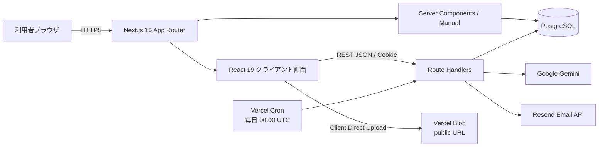
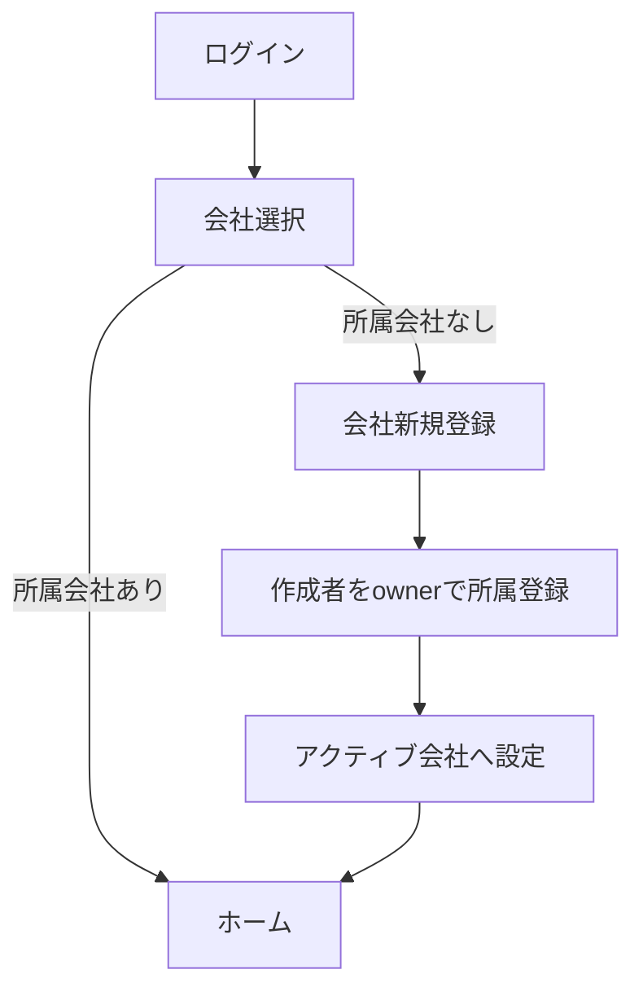
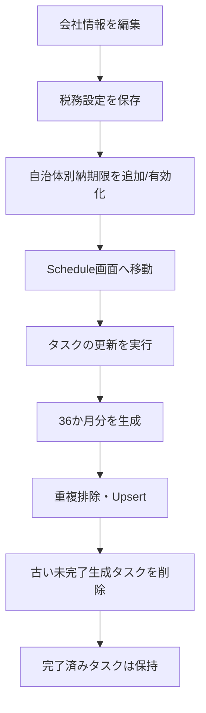
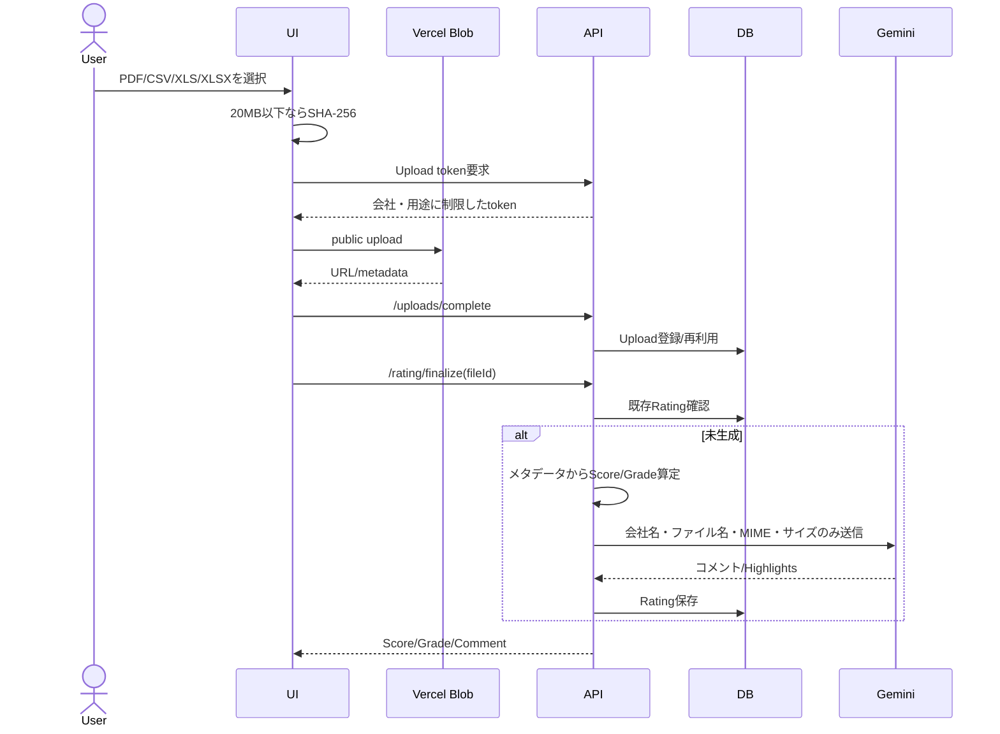
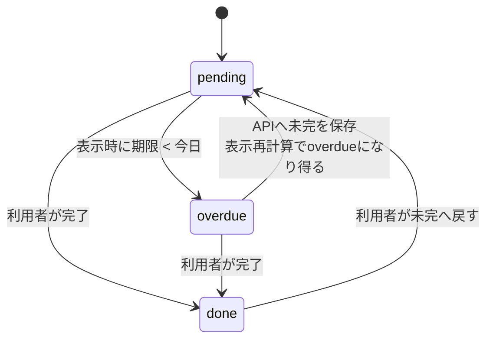
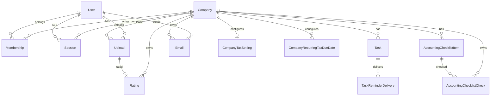

# CLAS FinOps システム仕様書

## 現行実装ベース / UIモダナイゼーション基準

| 項目 | 内容 |
|---|---|
| 対象リポジトリ | `ANOSkdy/finops_clas` |
| 対象ブランチ | `main` |
| 基準コミット | `8d4300d844e30a0b37ec98843e9259ef24e758e7` |
| 基準コミット概要 | PR #70 マージ: `UI: unify app layout, navigation, and card styling` |
| 調査日 | 2026-07-16（JST） |
| 文書種別 | AS-ISシステム仕様書 + UI刷新時の非破壊要件 + リスク/追加調査票 |
| 対象バージョン | 上記コミットへ固定したコードベース |

> **トレーサビリティ:** 本書はGitHub上の最新`main`を再確認し、上記SHAへ固定してソースコード・設定・マイグレーションを逆解析した結果である。実稼働DB、Vercelプロジェクト設定、外部サービス管理画面、実ユーザーデータ、アクセスログ、画面キャプチャを用いた実機検証は含まない。

---

## 1. 文書の目的

本書は、CLAS FinOpsの業務機能・データ処理・認可・外部連携を維持または改善しながら、UIをLinear風のモダンで高密度なデザインへ刷新するための基準資料である。

目的は次の3層に分かれる。

| 層 | 本書で整理する内容 | 目的 |
|---|---|---|
| 機能維持 | 業務フロー、認証・認可、タスク生成、API、データモデル、状態遷移 | 見た目の変更で業務ロジックを壊さない |
| UI刷新 | 画面構成、共通UI、レスポンシブ、アクセシビリティ、現行の不整合 | Linear風UIへの安全な置換条件を定める |
| リスク管理 | セキュリティ、税務日付、タイムゾーン、外部連携、テスト・運用不足 | 刷新後の安定運用と監査可能性を確保する |

### 1.1 記載区分

- **現行仕様:** コードで確認できる現在の挙動。
- **問題/リスク:** コード上の不整合、運用上の危険、未整備事項。
- **刷新要件:** UI刷新時に守るべき不変条件、または改善する条件。
- **要確認:** リポジトリ外の情報が必要な事項。

---

## 2. エグゼクティブサマリー

CLAS FinOpsは、企業ごとの税務・労務期限管理、会計資料チェック、財務資料アップロード、試算表メール送信、簡易格付けコメント生成を提供するマルチテナントWebアプリケーションである。

実装はNext.js App Routerの単一アプリに集約されている。ブラウザ向け画面、REST形式のRoute Handler、認証・業務ロジック、PrismaによるPostgreSQLアクセスを同一リポジトリで管理し、Vercel Blob、Google Gemini、Resend、Vercel Cronへ接続する。

### 2.1 現行システムの中核

1. ログイン後、所属会社をアクティブ会社として選択する。
2. 会社情報・税務設定・任意納期限を登録する。
3. 36か月先までの税務・労務タスクを生成・同期する。
4. タスクを期限別に表示し、完了・未完了を更新する。
5. 年度×月の会計資料チェック表を管理する。
6. 決算書等をVercel Blobへアップロードし、簡易スコアとAIコメントを生成する。
7. 試算表をアップロードし、メールへ添付して送信履歴を保存する。
8. 毎日、期限に応じたリマインドメールを会社の連絡先へ送る。

### 2.2 UI刷新前に解消すべき最重要事項

| 優先度 | 課題 | 要旨 |
|---|---|---|
| P0 | 財務資料がpublic URL | Vercel Blobへ`access: public`で保存され、削除・保持期限・署名URLの仕組みがない |
| P0 | マニュアル認証境界 | MiddlewareはCookieの存在のみ確認し、マニュアル画面はサーバーから直接DBを読むため、偽Cookieで閲覧できる可能性がある |
| P0 | 税務期間計算の不整合 | 個人事業の確定申告対象年、法人税・法人消費税の中間対象期間にコード上の年/月ずれがある |
| P1 | 日本時間とUTCのずれ | 「今日」をUTCで算定するため、JST 0:00〜8:59に日付判定・年度判定が前日扱いになり得る |
| P1 | 日本の祝日未反映 | 期限調整は土日のみ。祝日Setを受け取れるが、現行APIから渡していない |
| P1 | `owner`が会社編集不可 | 会社作成者は`owner`になるが、編集可能なのは会社内`admin`またはシステム側`admin/global` |
| P1 | 未認証デバッグAPI | 環境情報・ユーザー件数を返す`/api/debug/*`が公開されている |
| P1 | 任意URL登録 | `/api/uploads/complete`は任意URLを登録でき、メール添付元として利用され得る |
| P1 | Cron上限200件 | ページングがなく、期限対象が200件を超えると後続が処理されない |
| P1 | 破壊操作の保護不足 | ユーザー削除・所属解除に確認、自己削除防止、最後の管理者/owner保護がない |
| P1 | APIエラー契約不一致 | APIは`error.details`を返すが、一部UIは`details`直下を参照する |
| P1 | デザイントークン移行残 | Tailwind旧変数を参照する画面・Dialogが残り、現行CSS変数と不整合 |
| P1 | 回帰テスト不足 | 税務スケジュールの単一スクリプト以外に、API/E2E/Visual/Accessibilityテストがない |

---

## 3. システムコンテキスト



### 3.1 システム境界

**システム内:**

- ログイン・セッション管理
- 会社選択とテナント境界
- 会社情報、税務設定、任意納期限
- 税務・労務タスク生成と同期
- タスク期限表示、完了状態
- 会計資料チェック表
- アップロードメタデータ
- 簡易格付けスコア、AIコメント
- メール送信履歴、期限通知履歴
- マニュアル閲覧

**外部サービス:**

- PostgreSQL
- Vercel Blob
- Google Gemini API
- Resend API
- Vercel Cron

**現行リポジトリに存在しない領域:**

- RFID/IoT連携
- 現場写真・図面・黒板・注釈
- 日報入力、工程管理
- Service Worker、PWA、オフライン同期
- 会計ソフト・銀行API等との自動連携
- SAML/OIDC/MFA
- GraphQL、gRPC、WebSocket

---

## 4. アーキテクチャ仕様

### 4.1 技術スタック

| 区分 | 現行技術 | 補足 |
|---|---|---|
| Webフレームワーク | Next.js `16.1.0` | App Router、React Compiler有効 |
| UI | React `19.2.3` | 多くの業務画面が`use client` |
| 言語 | TypeScript 5 | `strict: true`、Bundler module resolution |
| CSS | Tailwind CSS `4.1.18` + CSS Variables | 旧Tailwindテーマとの移行残あり |
| UIプリミティブ | Radix UI Dialog | Drawer/Modalのフォーカス管理 |
| API | Next.js Route Handlers | REST相当、JSON、Node.js runtime |
| 入力検証 | Zod `4.2.1` | API単位のSchema |
| ORM | Prisma `7.2.0` | `@prisma/adapter-pg`、driver adapter |
| DB | PostgreSQL | UUID、Date、Timestamptz、BigInt、UUID配列を使用 |
| パスワード | bcryptjs `3.0.3` | cost 10 |
| ファイル | Vercel Blob | クライアント直接アップロード、最大250MB |
| AI | `@google/genai` | 既定モデル`gemini-2.5-flash`、8秒タイムアウト |
| メール | Resend REST API | `MAIL_PROVIDER=resend`時のみ有効 |
| 定期実行 | Vercel Cron | 毎日`0 0 * * *` = 09:00 JST |
| パッケージ管理 | pnpm | ロックファイルあり |
| 想定ホスティング | Vercel | `vercel.json`、Blob、Cron、ビルドスクリプトから判断 |

### 4.2 レンダリング方式

| 種別 | 対象 | 特性 |
|---|---|---|
| Client Side Rendering | Home、Schedule、Upload、Rating、Trial Balance、Checklist、Settings、管理画面 | 画面マウント後に内部APIへ`fetch` |
| Server Component | Manual一覧・詳細、ルートレイアウト | ManualはDBを直接読む |
| キャッシュ | Manual一覧 | `unstable_cache`、60秒、tag=`manual` |
| 結果キャッシュ | Rating | `uploadId`単位でDB保存済み結果を再利用 |

### 4.3 UIとバックエンドの責務

| 責務 | 現行配置 | UI刷新時の方針 |
|---|---|---|
| 認証・テナント検証 | API/Server | 必ずサーバー側を正とする |
| 税務・労務タスク生成 | Server | UIへ移さない |
| 期限超過判定 | Server中心 | JST基準へ修正し、UI再実装を避ける |
| 入力検証 | UI + Zod API | APIを正、UIは即時フィードバック |
| ファイルSHA-256 | Client | 20MB以下のみ。仕様として明示 |
| 3か月表示フィルタ | Client | APIクエリ化または共有ロジック化を検討 |
| 会計チェックの楽観更新 | Client | 失敗時ロールバックを維持 |
| Rating score | Server | バージョン管理を追加すべき |
| AIコメント | Server | モデル・プロンプト・生成時刻を監査可能にする |
| メール確認 | Client | 送信前確認を維持 |
| メール送信・履歴 | Server | 再送/冪等性の方針を追加 |

---

## 5. 認証・認可・マルチテナント

### 5.1 セッション仕様

- ログインIDとパスワードで認証する。
- パスワードはbcrypt cost 10で照合・保存する。
- セッショントークンは32バイト乱数をBase64URL化する。
- DBには平文トークンではなく、`AUTH_SESSION_SECRET`を用いたHMAC-SHA256を保存する。
- セッション有効期間は14日。
- 本番Cookie名は`__Host-clasz_session`、開発は`clasz_session`。
- Cookie属性は`HttpOnly`、本番`Secure`、`SameSite=Lax`、`Path=/`。
- 最終アクセス時刻はベストエフォートで更新する。
- パスワード変更後も既存セッションは失効しない。

### 5.2 二層ロール

#### システムロール `User.role`

| 値 | 現行権限 |
|---|---|
| `global` | 全ユーザー・全会社所属管理、会社編集、システム管理画面 |
| `admin` | アクティブ会社の編集権限を持つが、全ユーザー管理は不可 |
| `user` | 通常利用 |

#### 会社内ロール `Membership.roleInCompany`

| 値 | 現行権限 |
|---|---|
| `owner` | 会社所属として通常機能を利用できるが、会社編集権限は付与されない |
| `admin` | 会社情報・税務設定・任意納期限を編集可能 |
| `member` | 通常機能を利用可能 |
| `accountant` | 現行コードでは`member`と実質同じ権限 |

### 5.3 現行アクション権限表

| アクション | 必要条件 |
|---|---|
| 会社一覧閲覧・会社選択 | ログイン + 対象Membership |
| 会社新規作成 | ログイン済み。作成者を`owner`として登録 |
| 会社情報閲覧 | アクティブ会社のMembership |
| 会社情報・税務設定・任意納期限編集 | `User.role=admin/global` または `roleInCompany=admin` |
| タスク生成・再同期 | アクティブ会社のMembership |
| タスク完了更新 | アクティブ会社のMembership |
| 会計チェック閲覧・更新・項目追加 | アクティブ会社のMembership |
| Rating/Trial Balance Upload | アクティブ会社のMembership |
| メール送信 | アクティブ会社のMembership |
| 自分のパスワード変更 | ログイン済み |
| ユーザー作成・削除 | `User.role=global` |
| 会社メンバー追加・削除 | `User.role=global` |

### 5.4 認証境界の注意

MiddlewareはCookieの**存在だけ**を確認し、DBセッションの有効性は確認しない。通常の業務データAPIは各Route Handlerで再検証するためテナント境界が保たれるが、ManualはServer ComponentからDBを直接参照するため、ページ側にも有効セッション検証が必要である。

また、Middlewareの保護パス一覧に次が含まれていない。

- `/trial_balance`
- `/accounting_checklist`
- `/company_member`

各画面が利用するAPIは認証するが、ページシェルの保護が不統一である。

---

## 6. 画面一覧

| Route | 画面 | 主な機能 | 主なAPI | 現行アクセス条件/注意 |
|---|---|---|---|---|
| `/` | ランディング | ログイン・Manual導線 | なし | Middlewareで常に`/login`へ転送され、実質表示されない |
| `/login` | ログイン | ID/Password認証、`next`遷移 | `POST /api/auth/login` | `next`の許可先検証がない |
| `/selectcompany` | 会社選択 | 所属会社一覧、アクティブ会社変更 | auth/me、customer/list、customer/select | ログイン必須 |
| `/newcompany` | 会社登録 | 法人/個人、基本情報登録 | `POST /api/customer/new` | 任意ログインユーザー。作成後owner |
| `/home` | ホーム | 期限アラート、期限グループ | `GET /api/home/summary` | Membership必須 |
| `/schedule` | スケジュール | タスク再生成、月別一覧、完了切替 | schedule/list、schedule/refresh、tasks/status | 初期3か月、全表示切替 |
| `/upload` | アップロード入口 | Rating/Trial Balance選択 | なし | Link内Buttonの入れ子あり |
| `/rating` | 格付け | ファイル送信、スコア/AIコメント | customer、uploads、rating/finalize | public Blobの注意表示あり |
| `/trial_balance` | 試算表 | Upload、メール作成、確認、送信 | customer、uploads、mail/send | Middleware保護一覧外 |
| `/accounting_checklist` | 会計資料チェック | 年度、月別チェック、項目追加 | accounting-checklist系 | Middleware保護一覧外 |
| `/manual` | マニュアル一覧 | DB文書一覧 | ServerからDB直接 | 60秒キャッシュ。認証境界要修正 |
| `/manual/[slug]` | マニュアル詳細 | Markdown文字列表示 | ServerからDB直接 | Markdownを`pre`で表示し、レンダリングしない |
| `/settings` | 設定 | Password、会社編集、Logout、管理入口 | auth/me、auth/logout | Globalだけ管理入口を表示 |
| `/company_edit` | 会社編集 | 基本情報、税務設定、任意納期限 | customer、tax-settings、recurring | 長大フォーム、保存単位が3系統 |
| `/password` | Password変更 | 現在/新規/確認 | auth/me、account/password | 確認値はUIのみ |
| `/system_manager` | システム管理 | 管理メニュー | auth/me | Globalのみ |
| `/account` | アカウント管理 | ユーザー作成・削除 | account系 | Globalのみ、削除確認なし |
| `/company_member` | 会社メンバー管理 | 所属追加・削除 | company_member | Globalのみ、削除確認なし、Middleware保護一覧外 |

---

## 7. 主要ユーザージャーニー

### 7.1 初回利用



### 7.2 会社・税務設定から期限生成



> 現行では会社・税務設定の保存後にタスクを自動再生成しない。利用者がSchedule画面で「タスクの更新」を実行する必要がある。

### 7.3 タスク処理

1. Schedule APIから全タスクを期限順で取得する。
2. DBが`done`なら完了表示する。
3. 未完了で期限が「今日」より前なら表示上`overdue`にする。
4. 初期表示はクライアント側で3か月以内へ絞る。
5. 月ごとに税務・労務・その他へ分類する。
6. 完了ボタンで`pending|done`を更新する。
7. 再読み込み時、未完了かつ期限切れは再び`overdue`表示になる。

### 7.4 会計資料チェック

1. 年度を選択する。既定年度は4月始まり。
2. 初回取得時、既定5項目が不足していれば自動作成する。
3. 4月〜翌3月のチェックボックスを表示する。
4. UIで楽観的に切替え、APIで会社・項目・年度・月単位にUpsertする。
5. 保存失敗時は再読込してサーバー状態へ戻す。
6. 任意項目を末尾へ追加できる。

### 7.5 Rating



### 7.6 Trial Balanceメール送信

1. CSV/XLS/XLSXを選択する。
2. Vercel Blobへ`trial_balance`用途でアップロードする。
3. Uploadレコードを登録する。
4. 宛先・件名・本文を編集する。
5. 確認Dialogで宛先・件名・添付IDを確認する。
6. Emailレコードを`queued`で作成する。
7. Resendへ同期送信する。
8. 成功時`sent`、失敗時`failed`とエラーを保存する。

### 7.7 グローバル管理

- ユーザー作成時、任意会社へ`member`として初期所属できる。
- 会社メンバー画面で、全会社・全ユーザー間のMembershipを追加・削除する。
- ユーザー削除はUploadまたはEmailが残る場合に409で拒否する。
- 現行UIはユーザー削除・Membership削除を確認Dialogなしで実行する。

---

## 8. 業務ロジック仕様

### 8.1 タスク生成共通仕様

- 基準日から既定36か月先まで生成する。
- 生成対象は基準日以降の期限のみ。
- 日付はUTCのDate-onlyとして扱う。
- 期限が土日または渡された休日Setに含まれる場合、次の営業日へ繰り延べる。
- 現行のSchedule Refreshは休日Setを渡さないため、実際には土日のみを調整する。
- 標準タスクと会社任意納期限が同一の「カテゴリ + 名称 + 期限」になる場合、標準タスクを優先する。
- `taskKey`でUpsertし、同一会社内の生成を冪等化する。
- 再生成で不要になった`pending/overdue`生成タスクは削除する。
- `done`は履歴として残す。

### 8.2 税務タスク

| 区分 | コード上の生成規則 |
|---|---|
| 源泉所得税・毎月 | 対象月の翌月10日 |
| 源泉所得税・納期特例 | 1〜6月分: 7月10日、7〜12月分: 翌年1月20日 |
| 住民税特別徴収・毎月 | 対象月の翌月10日 |
| 住民税特別徴収・納期特例 | 12〜5月分: 6月10日、6〜11月分: 12月10日 |
| 法定調書等 | 1月31日 |
| 法人税・地方税確定 | 事業年度末の2か月後 |
| 法人税中間 | 前期法人税（国税）額が200,000円超の場合に生成 |
| 法人消費税確定 | 課税事業者の場合、事業年度末の2か月後 |
| 個人所得税確定 | 3月15日 |
| 個人消費税確定 | 課税事業者の場合、3月31日 |
| 消費税中間回数 | 前年度国税分: `<=480,000/null=0`、`<=4,000,000=1`、`<=48,000,000=3`、`>48,000,000=11` |
| 自治体/任意納期限 | 設定した月日を毎年生成し、期別をタイトルへ付加 |

### 8.3 税務日付の要検証事項

以下は現行コードを法令・税務実務と照合すべき項目であり、UI側で補正してはならない。

1. **個人事業の対象期間:** 3月15日/3月31日期限のタスクに、同年1月〜12月が期間として設定されている。通常の確定申告対象年との関係を税務担当者と確認する。
2. **法人税中間の期間:** 事業年度開始から6か月後の月末を期間末としており、1か月後ろへずれる可能性がある。
3. **法人消費税中間の期間:** 1/3/11回の期間末が、事業年度開始から各月数後の「その月末」になり、1か月後ろへずれる可能性がある。
4. **祝日:** 日本の国民の祝日・金融機関休業日が反映されない。
5. **タイムゾーン:** JSTの午前0時から8時59分はUTC上前日となる。
6. **法令変更:** 閾値・期限がコードに固定され、ルールバージョンや施行日を持たない。

### 8.4 労務タスク

| タスク | 期限 | 対象期間 |
|---|---|---|
| 算定基礎届 | 7月10日 | 同年4月1日〜6月30日 |
| 労働保険年度更新 | 7月10日 | 前年4月1日〜同年3月31日 |

賞与支払届は「会社の賞与支給日設定が追加された後に生成する」TODOであり、未実装。

### 8.5 タスク状態



DBには`overdue`値を保存可能だが、一覧では`done`以外を日付で再計算する。

### 8.6 Reminder

| ポリシー | 対象taskKey | 事前通知 |
|---|---|---|
| major | 法人税、消費税、個人所得税等 | 30、14、7、3日前 |
| monthly | 源泉所得税、住民税特別徴収 | 7、3、1日前 |
| municipal | 任意/自治体納期限 | 14、7、1日前 |
| default | その他 | 7、1日前 |

全ポリシーで当日・期限超過を対象とする。`TaskReminderDelivery`の`taskId + channel + remindKey`一意制約により同一通知キーは1回のみ。したがって`overdue`通知も1タスクにつき原則1回である。

### 8.7 Home集計

- `overdue / today / within3Days / within7Days / within14Days / within30Days`へ分類する。
- 各グループ最大8件を返す。
- 近日タスクは最大5件。
- 「30日以内」のカウントに期限超過が含まれるため、ラベルと集計意味が一致しない可能性がある。

### 8.8 Accounting Checklist

- 年度範囲: 2000〜2100。
- 既定年度: 4月以降は当年、1〜3月は前年。
- 既定項目: 領収書、通帳、売上資料、請求書、クレジットカード明細。
- チェック一意キー: `companyId + itemId + fiscalYear + month`。
- 任意項目名: 1〜100文字。
- 任意項目の編集、削除、並べ替えは未実装。
- 項目名のDB一意制約はなく、同名重複を作成できる。

### 8.9 Upload

| 項目 | 仕様 |
|---|---|
| 用途 | `rating` / `trial_balance` |
| MIME | PDF、CSV、XLS、XLSX |
| 最大サイズ | 250MB/ファイル |
| 送信方式 | ブラウザからVercel Blobへ直接 |
| Blob path | `{companyId}/{purpose}/{YYYY-MM-DD}/{sanitizedFilename}` |
| Path制約 | `..`禁止、先頭`/`禁止、会社/用途prefix強制 |
| 公開範囲 | public URL |
| SHA-256 | クライアント側で20MB以下のみ計算 |
| DB再利用 | 同一会社・storageProvider・storageKeyが既存なら再利用 |

### 8.10 Rating

スコアはファイル内容を解析せず、次のメタデータだけで算定する。

```text
base = 62
+8: ファイル名に決算/financial/bs/pl/貸借/損益/試算/balance/income
+4: application/pdf
+3: CSV/Excel/Spreadsheet MIME
+2: size >= 200,000 bytes
+1: size >= 1,500,000 bytes
clamp: 40〜90
A: >=80 / B: >=65 / C: <65
```

Geminiへ送る情報は会社名、ファイル名、MIME、サイズ。ファイル本文は送信・解析しない。APIキー未設定、タイムアウト、JSON不正等では固定の一般助言へフォールバックする。

Ratingは`uploadId`単位でキャッシュされる。アルゴリズムやモデルを変更しても、既存Uploadの結果は自動再計算されない。スコア版、モデル版、プロンプト版は保存されない。

### 8.11 Mail

- 宛先: Email形式。
- 件名: 1〜200文字。
- 本文: 1〜20,000文字。
- 添付: 最大10ファイル。
- 添付可能用途: `trial_balance`のみ。
- 添付は同一会社に属する必要がある。
- DBへ`queued`を保存後、同期的に送信する。
- 成功時`sent + providerMessageId`、失敗時`failed + error`。
- `MAIL_PROVIDER`既定値は`disabled`。
- 添付合計サイズ制限、再送キュー、レート制限、冪等性キーはない。

### 8.12 Manual

- DBの`ManualDocument`を更新日時降順で表示する。
- 一覧は60秒キャッシュ。
- 詳細はMarkdown文字列を`pre`で表示する。
- 作成・更新・削除APIと管理画面は確認できない。
- `AiCache`モデルは現行コードから参照されていない。

---

## 9. API契約

### 9.1 共通形式

**成功:** APIごとに配列またはオブジェクトを直接返す。共通Envelopeはない。

**標準エラー:**

```json
{
  "error": {
    "code": "VALIDATION_ERROR",
    "message": "入力に誤りがあります",
    "details": [
      { "field": "fieldName", "reason": "too_small" }
    ]
  }
}
```

主なコード: `VALIDATION_ERROR`、`UNAUTHORIZED`、`FORBIDDEN`、`NOT_FOUND`、`CONFLICT`、`RATE_LIMITED`、`INTERNAL`、`AI_ERROR`、`STORAGE_ERROR`、`MAIL_ERROR`。

日付は原則`YYYY-MM-DD`、BigInt金額は10進文字列で返す。

### 9.2 Endpoint一覧

| Method | Path | 認証/権限 | 主な契約 |
|---|---|---|---|
| POST | `/api/auth/login` | Public | `{loginId,password}`、成功204、Cookie設定 |
| POST | `/api/auth/logout` | 任意 | Session削除を試行しCookie失効、204 |
| GET | `/api/auth/me` | Session | `{role}` |
| GET | `/api/customer` | Active Company Membership | 会社情報、会社内Role、User Role |
| PUT | `/api/customer` | System admin/global or Company admin | `{company:{...}}`、法人種別は変更不可 |
| GET | `/api/customer/list` | Session | 所属会社配列 |
| POST | `/api/customer/new` | Session | 会社作成、owner所属、Active化 |
| POST | `/api/customer/select` | Membership | `{companyId}`、成功204 |
| GET | `/api/company_member` | Global | 全会社・全User・Membership |
| POST | `/api/company_member` | Global | `{companyId,userId,roleInCompany}`、201 |
| DELETE | `/api/company_member` | Global | `{companyId,userId}`、204 |
| GET | `/api/account/list` | Global | User一覧 |
| GET | `/api/account/companies` | Global | Company選択肢 |
| POST | `/api/account/create` | Global | User作成、任意会社へmember所属、201 |
| POST | `/api/account/password` | Session | 現Password照合、新Password8文字以上、204 |
| POST | `/api/account/delete` | Global | Upload/Emailありは409、成功204 |
| GET | `/api/company/tax-settings` | Membership | 税務設定。金額は文字列 |
| PUT | `/api/company/tax-settings` | 編集権限 | 税務設定Upsert |
| GET | `/api/company/recurring-tax-due-dates` | Membership | 任意納期限一覧 |
| POST | `/api/company/recurring-tax-due-dates` | 編集権限 | 任意納期限作成、201 |
| PATCH/PUT | `/api/company/recurring-tax-due-dates/[id]` | 編集権限 | 部分更新 |
| DELETE | `/api/company/recurring-tax-due-dates/[id]` | 編集権限 | 削除、`{ok:true}` |
| GET | `/api/schedule/list` | Membership | Task配列、期限超過を動的算定 |
| POST | `/api/schedule/refresh` | Membership | 36か月生成・同期、`{ok:true}` |
| PATCH | `/api/tasks/[taskId]/status` | Membership | `{status:"pending"|"done"}` |
| GET | `/api/home/summary` | Membership | alerts、upcomingTasks、reminderGroups |
| GET | `/api/accounting-checklist` | Membership | `?fiscalYear=`、items/checks |
| POST | `/api/accounting-checklist/items` | Membership | `{name}`、201 |
| PATCH/POST | `/api/accounting-checklist/checks` | Membership | Check Upsert |
| POST | `/api/uploads/token` | Token発行時Membership | Vercel Blob Client Upload Handler |
| POST | `/api/uploads/complete` | Membership | Upload metadata登録、`{fileId,reused,url}` |
| GET | `/api/rating/ping` | Public | `{ok:true}` |
| POST | `/api/rating/finalize` | Membership | `{fileId}`、Score/Grade/AI comment |
| POST | `/api/mail/send` | Membership | 宛先/件名/本文/添付ID、送信結果 |
| GET/POST | `/api/cron/reminders` | `CRON_SECRET` | Bearerまたはquery secret、処理件数 |
| GET | `/api/debug/env` | Public | 環境変数の有無、cwd、NODE_ENV |
| GET | `/api/debug/db` | Public | DB接続結果、User件数またはエラー |

### 9.3 API契約上の不整合

1. `jsonError`は`error.details`を返すが、Account/Password/Company Member UIは`json.details`を読む。
2. Cronの401/503は標準エラーEnvelopeを使わない。
3. 一覧APIは配列、その他はオブジェクトで共通Envelopeがない。
4. `/api/uploads/complete`はBlob host、company path、MIME、最大サイズを再検証しない。
5. Accounting item APIは409を返さないが、UIは同名時409を想定する。
6. Recurring due date更新で`installmentLabel:null`を送っても、実装上クリアされない。

---

## 10. データモデル



### 10.1 エンティティ辞書

| Entity | 用途 | 主キー/一意性 | 削除挙動・注意 |
|---|---|---|---|
| User | 認証主体、システムRole | UUID、loginId unique | Session/Membership cascade、Upload/Email restrict |
| Company | テナント | UUID | 配下のTask/Upload/Email等をcascade |
| Membership | User-Company所属 | `(userId,companyId)` | Role文字列。最後のowner保護なし |
| Session | 14日Session、Active Company | tokenHash unique | User cascade、Company削除時activeCompany null |
| CompanyTaxSetting | 税務計算設定 | companyId unique | Company cascade |
| CompanyRecurringTaxDueDate | 年次任意期限 | UUID | 重複可、Company cascade |
| Task | 税務・労務・その他タスク | UUID、`companyId+taskKey` partial unique | Company cascade、期限はDate |
| TaskReminderDelivery | 通知監査 | `taskId+channel+remindKey` unique | Task cascade |
| AccountingChecklistItem | チェック項目 | UUID | company+name uniqueなし |
| AccountingChecklistCheck | 月別チェック | company+item+year+month unique | Company/Item cascade |
| Upload | Blob metadata | UUID | storageKey uniqueなし、User restrict |
| Rating | Rating結果 | uploadId unique | Upload/Company cascade |
| Email | 送信監査 | UUID | attachment IDsはUUID配列でFKなし、User restrict |
| ManualDocument | Manual | slug unique | CRUD経路未確認 |
| AiCache | 汎用AI cache | key | 現行未使用 |

### 10.2 データ整合性上の注意

- Uploadの重複判定はアプリの`findFirst -> create`で、DB一意制約がないため同時実行競合があり得る。
- Emailの`attachmentUploadIds`にはUploadへの外部キーがない。
- Ratingは`companyId`とUploadの会社一致をDB制約で保証しない。APIで保証する。
- AccountingCheckは`companyId`とItemの会社一致を複合FKで保証しない。APIで保証する。
- User/Company Role、Task status/category等は文字列で、DB CHECK/enumはない。
- Companyの法人番号に一意制約・チェックデジット検証はない。
- Upload/Email/Reminderの保持期限、匿名化、法定保存期間は定義されていない。

---

## 11. 外部連携仕様

### 11.1 PostgreSQL

- `DATABASE_URL`で接続。
- PrismaPg adapterを使用。
- Prisma Clientは開発時global singleton、遅延Proxy。
- CLI設定は`DATABASE_URL`未設定時にローカル既定URLへフォールバックする。
- Build時migrationは`PRISMA_MIGRATE_ON_BUILD=true`の場合のみ実行する。

### 11.2 Vercel Blob

- Client Upload Handlerを使用。
- Token発行時に会社・用途・path prefixを制限する。
- Upload完了CallbackはCookieなしのため、token payloadで会社/Userを識別する。
- ローカルではCallbackが呼ばれない想定のため、UIから`/uploads/complete`も呼ぶ。
- public URLであり、アクセス制御・署名URL・ダウンロードAPIはない。

### 11.3 Gemini

- `GEMINI_API_KEY`未設定時は固定フォールバック。
- `GEMINI_MODEL`未設定時は`gemini-2.5-flash`。
- 8秒タイムアウト。
- JSON Schemaで`aiComment`と`highlights`を要求。
- ファイル本文は送らず、会社名・ファイル名・MIME・サイズのみを送る。
- モデル名、prompt version、応答raw、token/cost、Safety結果を保存しない。

### 11.4 Resend

- `MAIL_PROVIDER=resend`時に有効。
- `MAIL_API_KEY`、`MAIL_FROM`必須、`MAIL_REPLY_TO`任意。
- 添付はBlobのremote URLをResendへ渡す。
- 外部APIエラー中のURLはログ保存前にマスクする。
- 同期処理であり、バックグラウンドRetryはない。

### 11.5 Vercel Cron

- Schedule: 毎日00:00 UTC、JST 09:00。
- Endpoint: `/api/cron/reminders`。
- `CRON_SECRET`をBearerまたはquery parameterで受け付ける。
- 最大200タスクを期限順で取得する。
- 同一通知キーの重複はDB unique + Prisma P2002でSkipする。

---

## 12. 環境変数

| 変数 | 必須度 | 用途 | 注意 |
|---|---|---|---|
| `DATABASE_URL` | 必須 | PostgreSQL接続、Prisma CLI | Secret |
| `AUTH_SESSION_SECRET` | 必須 | Session token HMAC | 十分な長さ、定期Rotation設計が必要 |
| `BLOB_READ_WRITE_TOKEN` | Blob利用時必須 | Vercel Blob | 変数名を変更可能 |
| `STORAGE_BLOB_TOKEN_ENV` | 任意 | Blob tokenを格納する変数名 | 既定`BLOB_READ_WRITE_TOKEN` |
| `GEMINI_API_KEY` | 任意 | Gemini | 未設定は固定コメント |
| `GEMINI_MODEL` | 任意 | Gemini model | 既定`gemini-2.5-flash` |
| `MAIL_PROVIDER` | 任意 | `resend`/`disabled` | 既定`disabled` |
| `MAIL_API_KEY` | Resend時必須 | Resend API | Secret |
| `MAIL_FROM` | Resend時必須 | From | Domain認証要確認 |
| `MAIL_REPLY_TO` | 任意 | Reply-To |  |
| `CRON_SECRET` | Cron時必須 | Reminder Endpoint認証 | query利用を廃止しBearer限定推奨 |
| `APP_URL` | 任意 | Reminder本文URL | 最優先 |
| `NEXT_PUBLIC_APP_URL` | 任意 | Reminder本文URL | ブラウザ公開値 |
| `VERCEL_URL` | Vercel提供 | Reminder本文URL fallback | Protocol補完 |
| `PRISMA_MIGRATE_ON_BUILD` | 任意 | Build中migration | 既定false |
| `DEMO_ADMIN_PASSWORD` | 開発用 | Demo seed password | 未設定時`password`。本番使用禁止 |
| `NODE_ENV` | Runtime | Cookie Secure/名称 |  |
| `DIRECT_URL` | 実処理では未使用 | Debug APIで有無のみ表示 | 設定意図を確認 |

リポジトリに`.env.example`は確認できない。環境ごとの必須値、Secret所有者、Rotation、Preview/Production分離を文書化する必要がある。

---

## 13. 現行UI/UX

### 13.1 デザイン基盤

- Light color schemeのみ。
- CSS変数で背景、文字、Border、Success/Danger/Caution、Shadow、Durationを定義。
- フォントはHelvetica Neue、Hiragino Sans、Noto Sans JP等のsystem stack。
- Cardは12px radius、薄いborder、最新コミットで既定shadowを削除。
- ButtonはPrimary/Secondary/Outline/Ghost/Danger、44〜48px高。
- Floating labelのField/Select/Textarea。
- Radix DialogでModal/Drawer。
- Toastは最大5件、aria-live、Errorは7秒、その他4.5秒。
- Sticky Header + 左Drawer Navigation。
- Main領域にSkip Link。
- `focus-visible` ring、44px touch target、safe-area、reduced-motion対応。

### 13.2 既存の良い点

- 多くの入力にlabel、`aria-describedby`、`aria-invalid`がある。
- Error messageに`role=alert`を付ける。
- Toastに`status/alert`と`aria-live`がある。
- Drawer/ModalはRadixによるフォーカストラップ、Escape、Portalを利用する。
- Loading、Empty、Needs Login、Needs Company、Errorの状態を複数画面で明示する。
- Check tableは先頭列sticky、横スクロール対応。
- ファイル送信・Rating実行・Logoutで確認Dialogがある。
- Motion軽減設定がある。

### 13.3 現行のUI課題

1. **デザイントークン二重化:** `globals.css`の新変数と`tailwind.config.js`の旧変数が混在する。`--button`、`--text-muted`等の定義が見当たらない。
2. **旧クラス残存:** `newcompany`、`company_edit`、Dialog、Account/Member一覧等に`glass`、`text-inkMuted`、`border-line`、`bg-ink`等が残る。
3. **Tailwind v4移行:** `globals.css`に旧configを読み込む`@config`指示がなく、旧テーマクラス生成が保証されない。
4. **Interactive要素の入れ子:** `Link/a`の中に`Button`を置く箇所があり、HTMLとしてbutton-in-anchorになる。
5. **内部ID露出:** File ID、Provider message IDを成功Toastや画面へ表示する。
6. **Manual:** Markdown構造をレンダリングせず、可読性・リンク・表・見出しが失われる。
7. **Schedule:** 全期間表示でも月見出しが「1月」のみで年を表示しない。
8. **Schedule status:** `overdue`から未完へ戻した直後、ローカル表示が一時的に`pending`となる。
9. **長大フォーム:** Company Editに基本/税務/納期限が連続し、未保存変更警告・Save bar・差分表示がない。
10. **破壊操作:** User/Membership削除に確認、対象名再入力、Undoがない。
11. **APIエラー表示:** 共通Error型がなく、画面ごとにStatus codeを解釈する。
12. **状態の色差:** ToastやTask badgeの成功/失敗/期限切れが視覚的にほぼ同じ。
13. **検索・Filter:** User、Membership、Task、Checklist itemに検索/Filter/Paginationがない。
14. **Home alert:** 全Alertが`warning`で、情報・成功・危険の区別がない。
15. **Root:** ランディングページを実装しているがMiddlewareにより表示されない。
16. **Company owner:** 画面上のRole名称と実際の編集権限が直感と一致しない。
17. **外部用語:** `rating`、`trial_balance`等の内部用途名がUI文言へ露出する。
18. **UX根拠不足:** Figma、画面キャプチャ、分析、User interview、Support ticketがRepoにない。

---

## 14. Linear風UI刷新要件

### 14.1 非破壊原則

1. UIから直接DBへアクセスしない。
2. テナント境界は必ずAPI/Serverで確認する。
3. タスク生成規則・`taskKey`・完了履歴保持を変更しない。
4. `rating`と`trial_balance`の用途分離を維持する。
5. 添付は同一会社かつ`trial_balance`のみという契約を維持する。
6. Accounting Checkの一意キーを維持する。
7. メール送信前の確認と送信履歴保存を維持する。
8. Rating既存結果の再利用仕様を、変更する場合はMigration/Versioningを設計する。
9. UIの「今日」「年度」「期限」はサーバー側のJST基準へ統一する。
10. API契約変更はVersioned typeとContract testを伴う。

### 14.2 情報設計

**Desktop:**

- 会社Switcherを最上位Contextとして固定表示。
- `Home / Schedule / Accounting / Documents / Manual / Settings`を左の常設Sidebarへ。
- 画面幅が小さい場合のみ現行Drawerへ縮退。
- Global管理は通常Navigationから分離し、管理セクションとして表示。
- Page headerへTitle、Description、Primary action、Secondary actionsを集約。
- Settingsは「会社」「税務」「通知」「アカウント」「管理」のSectionへ分割。

**Mobile:**

- 44px以上の操作領域。
- Bottom固定Primary actionはsafe-area対応。
- Checklistは横スクロールに加え、月選択式カード表示も提供。
- Company EditはAccordion/Stepではなく、保存単位が明確なSection navigationとする。

### 14.3 デザインシステム

- 新CSS変数を唯一のSource of Truthとする。
- 旧Tailwind theme tokenを削除または明示的に新tokenへAliasする。
- Colorだけで状態を伝えず、Icon + Text + Colorを併用する。
- Success、Warning、Danger、InfoのSurface/Border/Textを定義する。
- Radius、Spacing、Typography、Elevation、Motion、Z-indexをtoken化する。
- Status badgeは`未完 / 期限切れ / 完了`を文字で維持する。
- Focus ring、Reduced motion、High contrast、200% zoomを回帰対象にする。

### 14.4 コンポーネント化

最低限、次を共通化する。

- `AppShell` / `Sidebar` / `CompanySwitcher`
- `PageHeader`
- `DataTable` / `VirtualList`
- `StatusBadge`
- `EmptyState` / `ErrorState` / `LoadingState`
- `FormField` / `FormSection` / `StickySaveBar`
- `ConfirmDialog` / `DestructiveConfirmDialog`
- `FileDropzone` / `UploadProgress`
- `ApiErrorPresenter`
- `DateDisplay`（Asia/Tokyo固定）
- `MoneyField`（BigInt文字列）
- `PermissionGate`（表示のみ。認可はServer必須）

### 14.5 Typed API Client

- RouteごとのRequest/Response型を共通packageへ抽出する。
- Errorは`error.code/message/details`を一箇所でParseする。
- 401はLogin、404 Active CompanyなしはCompany Selectへ統一誘導する。
- MutationにはLoading、Double submit防止、Idempotency方針を持たせる。
- `fetch`の散在を減らし、Status code解釈を共通化する。

### 14.6 主要画面の刷新要件

| 画面 | 刷新要件 |
|---|---|
| Home | 期限切れ/本日/近日をSeverity別に表示し、件数とActionを直結 |
| Schedule | 年月見出し、Filter、検索、完了履歴、設定変更後の再生成CTA |
| Accounting | Sticky header/column、月/年度切替、項目管理、保存状態表示 |
| Rating | 「内容解析ではない」ことを常時明記し、Score算定根拠とVersionを表示 |
| Trial Balance | Drag & drop、サイズ/形式事前検証、送信先確認、送信履歴一覧 |
| Company Edit | Sectionごとの保存、未保存警告、変更後のSchedule再生成導線 |
| Account/Member | 検索、Role説明、破壊確認、最後の管理者/owner保護 |
| Manual | Markdown安全レンダリング、目次、検索、更新者/更新日 |

---

## 15. 非機能要件

### 15.1 セキュリティ

#### 現行で確認できる対策

- HttpOnly/Secure/SameSite Cookie。
- Session tokenのHMAC hash保存。
- bcrypt password hash。
- Zod validation。
- RouteごとのActive Company/Membership再検証。
- Upload tokenの会社/用途path scope。
- Mail attachmentの会社・用途検証。
- Reminder重複防止unique key。
- 外部メールエラー中URLのMask。

#### 未実装または要強化

- Public Blobの非公開化、署名URL。
- Manual Server ComponentのSession検証。
- Debug APIの削除またはGlobal/Internal限定。
- Login/Mail/AI/Upload/CronのRate limit。
- MFA、Password policy、Lockout、Credential rotation。
- Password変更時の全Session失効選択。
- CSRFの明示的Origin/Token方針。現行はSameSite=Laxへ依存。
- CSP、HSTS、Permissions-Policy等のSecurity header。
- Open redirect防止。`next`は相対Path allowlistに限定する。
- Upload completeのBlob host/path/MIME/size再検証。
- Audit log。会社/税務/Role/Task/Checklist変更のWho/When/Before/Afterがない。
- Secretの管理・Rotation手順。
- Data retention、削除、Export、バックアップ、復元。
- AI/メール/Blob各Providerとのデータ処理契約。

### 15.2 パフォーマンス

#### 現行特性

- 大容量ファイルはブラウザからBlobへ直接送信し、App Serverを経由しない。
- Manual一覧は60秒キャッシュ。
- Rating結果はDBキャッシュ。
- Gemini timeoutは8秒。
- Schedule/User/Membership/Home overdueは原則全件取得。
- Cronは200件上限でPaginationなし。
- Checklistは`items × 12`セルを一括描画する。

#### 初期目標案（要承認）

| 指標 | 目標案 |
|---|---|
| Core画面 API p95 | 外部APIを除き500ms以内 |
| Mutation p95 | 外部APIを除き1秒以内 |
| LCP p75 | 2.5秒以内 |
| INP p75 | 200ms以内 |
| CLS p75 | 0.1以下 |
| AI処理 | 10秒以内、段階ProgressとCancel/Retry |
| Schedule表示 | 500件超でServer paginationまたはvirtualization |
| Cron | 全対象をcursor paginationし、処理漏れ0 |

### 15.3 可用性・バックアップ

現行SLA、RTO、RPO、DB backup、Blob backup、復旧Runbookはリポジトリから確認できない。Production要件として次を定義する。

- 稼働率目標。
- PostgreSQL自動backupとPoint-in-time recovery。
- Blob削除・復元ポリシー。
- Migration失敗時Rollback。
- Resend/Gemini障害時の縮退動作。
- Cron未実行・失敗の検知と再実行。

### 15.4 対応環境

明示的なBrowser/OS support定義はない。初期案として、最新2 majorのChrome/Edge/Safari、iOS Safari、Android Chromeを対象にし、実利用端末を確認する。

### 15.5 アクセシビリティ

目標はWCAG 2.2 AAを推奨する。

- 全機能Keyboard操作。
- Focus順とModal focus return。
- Text contrast、Status非Color依存。
- 200% zoom/400% reflow。
- Screen reader用label、live region。
- Reduced motion。
- Form error summaryとField error紐付け。
- Automated axe + Manual NVDA/VoiceOver test。

### 15.6 オフライン

現行はオフライン非対応。FinOps業務として必要性を確認し、必要な場合は単なるUI変更ではなく、次を別Architectureとして設計する。

- Service Worker/PWA。
- IndexedDB暗号化。
- Mutation queue。
- Conflict resolution。
- Tenant切替時のLocal data隔離。
- File upload再開。
- Sync状態と最終同期時刻。

---

## 16. 開発・ビルド・テスト・運用

### 16.1 コマンド

| Command | 用途 |
|---|---|
| `pnpm dev` | Next dev（webpack） |
| `pnpm dev3010` | Port 3010でdev |
| `pnpm build` | Custom Vercel build |
| `pnpm start` | Production server |
| `pnpm lint` | ESLint |
| `pnpm typecheck` | Prisma generate + `tsc --noEmit` |
| `pnpm test:tax-schedule` | 税務Schedule assert script |
| `pnpm postinstall` | Prisma generate |

### 16.2 Build

1. `PRISMA_MIGRATE_ON_BUILD=true`なら`prisma migrate deploy`。
2. `prisma generate`。
3. `next build`。

既定ではMigrationをSkipするため、DB schemaとApplication deployを別途同期する運用が必要。

### 16.3 現行テスト資産

`scripts/test-tax-schedule.ts`のみ確認できる。検証内容は次の通り。

- 月末clamp。
- 源泉所得税特例時にmonthlyを生成しない。
- 7月決算法人の確定期限。
- 標準タスクと任意タスクの見た目重複で標準を優先。

未確認/未実装:

- Component test。
- API integration/contract test。
- Auth/tenant isolation test。
- DB migration test。
- E2E。
- Visual regression。
- Accessibility test。
- Load/soak test。
- Cron pagination/retry test。
- AI/mail/blob mock test。
- Tax rule golden master。

### 16.4 CI/CD

GitHub Actions workflowは検索で確認できない。推奨Pipeline:

```text
PR
 ├─ install --frozen-lockfile
 ├─ lint
 ├─ typecheck
 ├─ unit / tax golden tests
 ├─ API contract / tenant isolation tests
 ├─ component / accessibility tests
 ├─ E2E + visual regression
 ├─ prisma migrate diff / validation
 └─ next build
Preview
 ├─ smoke test
 ├─ migration compatibility check
 └─ product review
Production
 ├─ controlled migration
 ├─ deploy
 ├─ smoke / synthetic monitoring
 └─ rollback decision
```

### 16.5 監視・ログ

現行はCronの`console.info/error`が中心。Sentry、OpenTelemetry、APM、structured logger、business metricsは確認できない。

最低限必要な監視:

- 5xx rate、API latency。
- Login failure/rate limit。
- Cron scanned/eligible/sent/failed/lag。
- Mail provider failure。
- Blob upload completion mismatch。
- Gemini timeout/fallback率。
- Task generation件数・削除件数・重複件数。
- Tenant authorization failure。
- DB connection pool/slow query。
- Audit log export。

---

## 17. リスク登録簿

| ID | 優先度 | 領域 | リスク | 推奨対応 |
|---|---|---|---|---|
| R-01 | P0 | Data Security | 財務資料がpublic Blob URL | Private Blob/署名URL/Download APIへ移行。既存URL棚卸し |
| R-02 | P0 | Auth | Manualは偽CookieでServer DB読取可能性 | Server layoutでSession検証、Middlewareは有効Session確認 |
| R-03 | P0 | Business | 個人申告・法人中間期間の年/月ずれ | 税理士レビュー、Golden test、既存Task影響調査 |
| R-04 | P1 | Timezone | JST 0:00〜8:59の「今日」ずれ | Asia/Tokyo date serviceへ統一 |
| R-05 | P1 | Compliance | 日本祝日を期限調整しない | 祝日calendar source/versionを導入 |
| R-06 | P1 | RBAC | 作成者ownerが会社編集不可 | Role定義を決定し、Server/UI/文言を統一 |
| R-07 | P1 | Info Leak | Debug env/dbがPublic | Production無効化、Internal/Global限定 |
| R-08 | P1 | SSRF/Attachment | Upload completeに任意URL登録可 | Blob host/path/token metadataをServerで検証 |
| R-09 | P1 | Redirect | Login `next`が未検証 | 同一origin相対Path allowlist |
| R-10 | P1 | Notification | Cronが先頭200件のみ | Cursor pagination、batch、timeout budget、再実行 |
| R-11 | P1 | Admin Safety | 自己削除/最後のglobal/最後のowner保護なし | Server invariant + Confirm dialog |
| R-12 | P1 | API Contract | UIが`json.details`を参照 | Shared typed client、contract test |
| R-13 | P1 | UI | 旧token/未定義CSS変数 | Token migration、Stylelint/visual regression |
| R-14 | P1 | Test | E2E/tenant/security回帰なし | UI刷新前にcharacterization testsを作成 |
| R-15 | P1 | Data Lifecycle | Upload delete/retentionなし | 保持期限、法定保存、削除API、Blob削除audit |
| R-16 | P1 | Schedule | 設定保存後に再生成されない | Dirty indicator、再生成CTAまたはtransactional refresh |
| R-17 | P2 | Data Integrity | Upload dedupeにDB uniqueなし | `(companyId,provider,key)` unique |
| R-18 | P2 | Checklist | 同名項目重複、UIは409想定 | Unique/normalize、Edit/Delete/Reorder |
| R-19 | P2 | Recurring | installmentLabelをnull clear不可 | Update DTOとPrisma dataを修正 |
| R-20 | P2 | Mail | 同期送信、合計添付サイズ/Retryなし | Queue、idempotency、size limit、Retry policy |
| R-21 | P2 | AI Product | Ratingが内容解析のように見える | 表示名/Disclaimer/算定根拠/Versionを明示 |
| R-22 | P2 | AI Audit | Model/Prompt/Score versionなし | Version列、再評価方針、raw metadata |
| R-23 | P2 | Navigation | Middleware保護Path漏れ | Route group単位のServer authへ置換 |
| R-24 | P2 | Session | Password変更後も全Session有効 | 全端末Logout選択、Session一覧 |
| R-25 | P2 | Manual | CRUD/管理画面なし、Markdown未描画 | Authoring workflow、安全なrenderer、cache invalidation |
| R-26 | P2 | UX | Schedule月見出しに年なし | `YYYY年M月`、現在月/年度区切り |
| R-27 | P2 | Notification | overdue通知が一度のみ | Product policyを確認し、日次/週次Escalationを設計 |
| R-28 | P2 | Docs | READMEが汎用Next starter、env sampleなし | Onboarding/Runbook/Architecture Decisionを整備 |
| R-29 | P2 | Seed | Demo seed既定`admin/password` | Production guard、明示Flag、弱いDefault削除 |
| R-30 | P2 | Observability | Structured log/APM/alertなし | Trace ID、tenant-safe log、Dashboard/Alert |

---

## 18. UI刷新の受入条件

### 18.1 機能回帰

- [ ] Login成功204、失敗401、Cookie属性が維持される。
- [ ] 未所属会社のデータへアクセスできない。
- [ ] 会社切替後、すべてのAPIが新しいActive Companyへ切り替わる。
- [ ] 会社作成後、作成者MembershipとActive Companyが設定される。
- [ ] 会社情報/税務設定/任意期限のRole境界が仕様通り。
- [ ] Schedule refreshを複数回実行して重複しない。
- [ ] 完了済みTaskがrefreshで削除・未完化されない。
- [ ] 不要になった未完了生成Taskだけが削除される。
- [ ] 期限切れ表示がAsia/Tokyoの暦日で正しい。
- [ ] 税務ルールGolden testが法令レビュー済み期待値と一致する。
- [ ] Checklistの楽観更新失敗時に正しくRollbackする。
- [ ] Rating用途のFileだけRatingできる。
- [ ] Trial Balance用途のFileだけMail添付できる。
- [ ] 他社File IDを指定しても403。
- [ ] Rating既存結果のCache方針が維持またはVersion migrationされる。
- [ ] Mail送信前確認とEmail監査行が必ず作成される。
- [ ] Reminderが重複せず、200件超でも処理漏れがない。

### 18.2 UI/Accessibility

- [ ] すべての画面がKeyboardだけで操作できる。
- [ ] Focusが常時視認できる。
- [ ] Drawer/ModalのFocus trap、Escape、Close後Focus returnが正しい。
- [ ] LinkとButtonを入れ子にしない。
- [ ] Form error summaryからFieldへ移動できる。
- [ ] StatusをColorだけに依存しない。
- [ ] 320px幅、200% zoom、Landscape tabletで横切れしない。
- [ ] Reduced motionで不要なAnimationが停止する。
- [ ] Screen readerでTable header、Checkbox label、Toastを理解できる。
- [ ] Visual regressionで主要画面のLight themeを比較する。

### 18.3 Security

- [ ] Manualを含む全App routeで有効SessionをServer検証する。
- [ ] Public Blobを廃止または承認済みリスクとして記録する。
- [ ] Debug APIがProductionで到達不能。
- [ ] `next`が外部URL・protocol-relative・javascript schemeを拒否する。
- [ ] Upload metadataが認可済みBlobのみを受け付ける。
- [ ] User/Member削除にServer invariantと確認操作がある。
- [ ] Login/Mail/AI/UploadにRate limitがある。
- [ ] Security headersとSecret rotationが検証される。

---

## 19. 追加収集チェックリスト

### 19.1 Existing System Inventory

| 情報 | Repo確認 | 追加で必要 |
|---|---|---|
| 技術stack | 確認済み | 実Production version、Vercel plan |
| Hosting | Vercelと推定 | Project/Region/Domain/Deployment protection |
| DB | PostgreSQL/Schema確認 | Provider、Region、容量、Backup、Connection limit |
| Storage | Vercel Blob確認 | Store設定、公開範囲、使用量、既存URL |
| AI | Gemini確認 | 契約、Region、Data retention、月額上限 |
| Mail | Resend確認 | Domain認証、送信上限、Bounce/Complaint対応 |
| Cron | 09:00 JST確認 | 実行履歴、失敗通知、Manual retry |
| Environment | Codeから逆算 | 実値所有者、Rotation、環境差分 |

### 19.2 Core User Flows

- [ ] 実利用Persona: Global管理者、会社管理者、会計担当、一般利用者。
- [ ] 1人が管理する会社数。
- [ ] 会社作成を一般Userへ許可する理由。
- [ ] `owner`と`admin`の期待権限。
- [ ] Task完了の業務上の証跡要否。
- [ ] Schedule refreshを誰がいつ実行するか。
- [ ] 税務設定変更後の承認/再生成フロー。
- [ ] Reminder送信先が会社代表Email1件で十分か。
- [ ] Overdue reminderを一度だけ送るか、繰り返すか。
- [ ] Trial Balance送信の承認者、宛先候補、定型文。
- [ ] Ratingの利用目的と「格付け」表現の法務/業務妥当性。
- [ ] Manualの作成者、承認者、公開範囲。

### 19.3 API & Data Contract

- [ ] OpenAPIまたは型生成の採用。
- [ ] Production payload例とエラー例。
- [ ] Date/Timezoneの正式規約。
- [ ] Tax ruleの根拠、施行日、version。
- [ ] Data量: Company/User/Task/Upload/Email/Checklist。
- [ ] Uploadの平均/最大サイズと月間件数。
- [ ] Email送信量と失敗率。
- [ ] Rating実行量、Gemini fallback率。
- [ ] Data retention、削除、Export、監査要件。
- [ ] PII/機密区分。

### 19.4 UI Pain Points & Requirements

- [ ] 現行全画面のDesktop/Mobile screenshot。
- [ ] Figma/Brand kit/Logo使用規定。
- [ ] 主要Taskの完了時間、Click数、Error率。
- [ ] Support ticket、User interview、Session recording。
- [ ] 利用端末、画面サイズ、Browser、ネットワーク。
- [ ] Keyboard shortcut/Command paletteの必要性。
- [ ] 表示密度、文字サイズ、色覚配慮。
- [ ] Japanese date/money/Role用語の統一。
- [ ] Internal IDを利用者へ表示する必要性。
- [ ] Empty/Error/Permission deniedの文言基準。

### 19.5 Constraints & Risks

- [ ] 税理士/社労士による期限計算レビュー。
- [ ] 電子帳簿保存法等の保存・改ざん防止要件。
- [ ] 個人情報保護、金融資料の外部Cloud保存承認。
- [ ] Gemini/Resend/Vercelへのデータ送信承認。
- [ ] RTO/RPO/SLA。
- [ ] Migration可能時間、Zero-downtime要件。
- [ ] 旧Blob URLの移行/無効化方法。
- [ ] Rollback、Feature flag、段階Rollout。
- [ ] 監査Logの保存期間と閲覧権限。
- [ ] Production debug/seed無効化。

---

## 20. 建設業・Acoru/RFID要件との適用関係

本リポジトリの現行中核はFinOpsであり、建設現場向け日報/RFIDシステムではない。したがって、次の項目は現行機能の維持対象ではなく、将来拡張または別システム連携として扱う。

| 項目 | 現行実装 | 将来追加時の最低要件 |
|---|---|---|
| オフライン | なし | PWA、暗号化Local DB、同期Queue、Conflict UI |
| 写真 | Image MIME非対応 | Private object storage、Exif/撮影時刻、注釈、圧縮、改ざん検知 |
| 図面/黒板 | なし | Version、Annotation、権限、Offline cache |
| RFID | なし | Reader gateway、Device identity、Event idempotency、再送 |
| IoT | なし | Device registry、Telemetry queue、監視、Clock skew |
| AI日報 | なし | Source evidence、Human approval、Prompt/model version、監査 |
| 現場作業員UI | 対象外 | 大型Touch、片手操作、低通信、誤操作防止、音声/Scan |

FinOpsとAcoruを統合する場合でも、Company/User/Role/Uploadを安易に共有せず、Bounded Context、Data ownership、Tenant ID、Event contractを先に定義する。

---

## 21. 推奨実施順序

### Phase 0: Characterization

1. 税務・労務Golden masterを作る。
2. Auth/Tenant/API contract testを作る。
3. 主要画面のScreenshot/Visual baselineを保存する。
4. Production data量・性能・外部連携失敗率を計測する。

### Phase 1: Production Safety

1. Blob非公開化。
2. Manual/Route Server auth統一。
3. Debug API停止。
4. Tax period/祝日/JST修正。
5. Cron pagination。
6. Upload URL検証。
7. Admin destructive invariant。

### Phase 2: Contract & Design Foundation

1. Typed API client。
2. Error contract統一。
3. Token統合、旧Tailwind classes撤去。
4. Shared date/money/permission components。
5. CI + E2E + Accessibility + Visual tests。

### Phase 3: Linear風UI

1. App shell/Sidebar/Company switcher。
2. Home/Schedule。
3. Accounting。
4. Upload/Rating/Trial Balance。
5. Company Settings。
6. Global Admin。
7. Manual。

### Phase 4: Rollout

1. Feature flagまたはRoute単位の段階切替。
2. Shadow/Parallel measurement。
3. RoleごとのUAT。
4. Error/Latency/Conversion監視。
5. 旧UI rollback期間を設定。

---

## 22. ソース索引

### 22.1 基盤

- `package.json`
- `next.config.ts`
- `tsconfig.json`
- `tailwind.config.js`
- `postcss.config.js`
- `src/app/globals.css`
- `src/app/layout.tsx`
- `src/app/(app)/layout.tsx`
- `src/middleware.ts`
- `vercel.json`
- `scripts/vercel-build.mjs`

### 22.2 認証・API共通

- `src/lib/auth/session.ts`
- `src/lib/auth/tenant.ts`
- `src/lib/auth/rbac.ts`
- `src/lib/auth/password.ts`
- `src/lib/api/response.ts`
- `src/lib/api/errors.ts`
- `src/lib/ui/fetcher.ts`

### 22.3 データ

- `prisma/schema.prisma`
- `prisma/config.ts`ではなくルートの`prisma.config.ts`
- `prisma/migrations/**/migration.sql`
- `src/lib/db/index.ts`

### 22.4 業務ロジック

- `src/lib/tasks/taxSchedule.ts`
- `src/lib/tasks/laborSchedule.ts`
- `src/lib/tasks/syncGeneratedTasks.ts`
- `src/lib/tasks/format.ts`
- `src/lib/tasks/reminderPolicy.ts`
- `src/lib/date/businessDay.ts`
- `src/lib/rating/scoring.ts`
- `src/lib/ai/ratingComment.ts`
- `src/lib/uploads/db.ts`
- `src/lib/uploads/path.ts`
- `src/lib/mail/**`
- `src/lib/manual/getManualDocs.ts`

### 22.5 主要Route Handlers

- `src/app/api/auth/**`
- `src/app/api/customer/**`
- `src/app/api/company/**`
- `src/app/api/company_member/route.ts`
- `src/app/api/account/**`
- `src/app/api/schedule/**`
- `src/app/api/tasks/[taskId]/status/route.ts`
- `src/app/api/home/summary/route.ts`
- `src/app/api/accounting-checklist/**`
- `src/app/api/uploads/**`
- `src/app/api/rating/**`
- `src/app/api/mail/send/route.ts`
- `src/app/api/cron/reminders/route.ts`
- `src/app/api/debug/**`

### 22.6 UI

- `src/components/layout/AppHeader.tsx`
- `src/components/features/tasks/TaskList.tsx`
- `src/components/ui/Button.tsx`
- `src/components/ui/Card.tsx`
- `src/components/ui/Field.tsx`
- `src/components/ui/Dialog.tsx`
- `src/components/ui/toast.tsx`
- `src/app/(app)/**/page.tsx`

### 22.7 テスト/開発補助

- `scripts/test-tax-schedule.ts`
- `scripts/seed-demo-user.ts`
- `tools/env-merge.ps1`

---

## 23. 調査上の制約

- 実アプリの起動、Build、Test、Browser操作は実施していない。
- Production/Previewの環境変数・Provider設定は確認していない。
- DB実データ、Migration適用状況、Query planは確認していない。
- Vercel、Gemini、Resendの管理画面・契約・Logは確認していない。
- 税務・労務ルールの法的妥当性は、コード仕様として記録したもので、専門家レビューを代替しない。
- Figma、Screenshot、Analytics、Support ticket、User interviewは提供されていない。
- API仕様はコードからの逆解析であり、OpenAPI文書ではない。

---

## 24. 文書更新ルール

- `main`の基準SHAを必ず更新する。
- DB migration、API contract、Role、Tax rule、External provider変更時は本書を同一PRで更新する。
- AS-ISとTO-BEを混在させず、変更済み項目へ実装CommitとRelease日を記録する。
- 税務ルールは「Rule ID / Version / Effective date / Reviewer」を持たせる。
- Security riskの受容はOwner、期限、代替統制を記録する。

